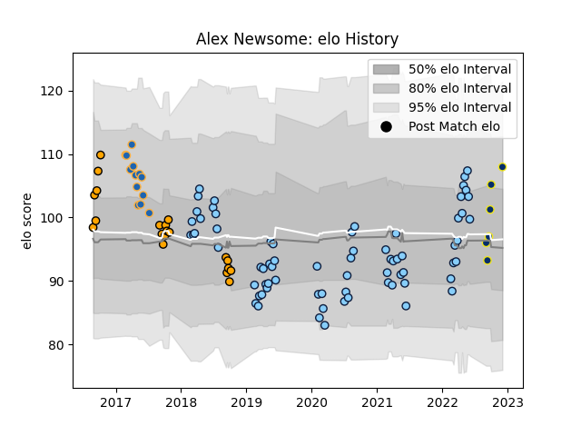

---  
layout: page  
title: Alex Newsome  
date: 2022-12-18 16:17:11.487256  
categories: player  
---
# Alex Newsome

## Positions: W, FB

## Current elo: 109.0

## Current Percentile: 86.0

# Elo History

# Match History

| Team                     |   Appearances |   Win Rate |
|:-------------------------|--------------:|-----------:|
| New South Wales Waratahs |            71 |   0.387324 |
| NSW Country Eagles       |            20 |   0.575    |
| Western Force            |            13 |   0.384615 |
| Clermont Auvergne        |             8 |   0.625    |

| Opponent                 |   Matches |   Win Rate |
|:-------------------------|----------:|-----------:|
| Queensland Reds          |        11 |   0.545455 |
| Melbourne Rebels         |        11 |   0.636364 |
| Brumbies                 |        10 |   0.1      |
| Western Force            |         7 |   0.571429 |
| Highlanders              |         5 |   0.4      |
| Lions                    |         5 |   0.2      |
| Blues                    |         5 |   0        |
| Crusaders                |         5 |   0.4      |
| Chiefs                   |         5 |   0        |
| Fijian Drua              |         4 |   0.5      |
| Hurricanes               |         4 |   0        |
| Sunwolves                |         4 |   0.75     |
| Canberra Vikings         |         3 |   0.666667 |
| Sharks                   |         3 |   0.166667 |
| Brisbane City            |         3 |   0.5      |
| Melbourne Rising         |         3 |   0.666667 |
| Jaguares                 |         3 |   0.333333 |
| Sydney Rays              |         2 |   1        |
| Greater Sydney Rams      |         2 |   0.5      |
| Stormers                 |         2 |   1        |
| Perth Spirit             |         2 |   1        |
| Lyon                     |         1 |   1        |
| La Rochelle              |         1 |   1        |
| Toulon                   |         1 |   0        |
| Stade Francais Paris     |         1 |   0        |
| Southern Kings           |         1 |   1        |
| Bulls                    |         1 |   0        |
| Leicester Tigers         |         1 |   0        |
| Queensland Country       |         1 |   0        |
| Pau                      |         1 |   1        |
| North Harbour Rays       |         1 |   1        |
| Montpellier Herault      |         1 |   1        |
| Moana Pasifika           |         1 |   1        |
| New South Wales Waratahs |         1 |   0        |