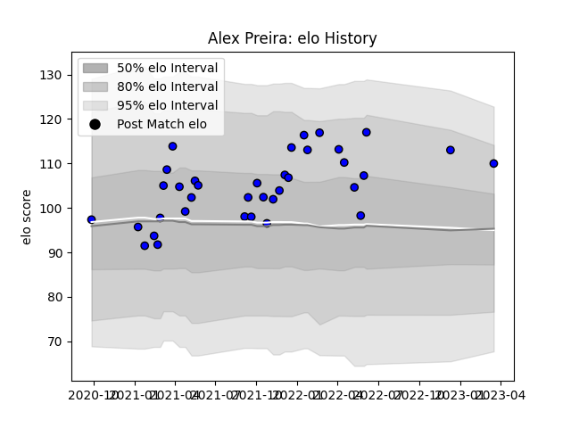

---  
layout: page  
title: Alex Preira  
date: 2022-12-18 16:28:24.884628  
categories: player  
---
# Alex Preira

## Positions: W

## Current elo: 98.0

## Current Percentile: 68.0

# Elo History

# Match History

| Team   |   Appearances |   Win Rate |
|:-------|--------------:|-----------:|
| Massy  |            27 |   0.648148 |

| Opponent                   |   Matches |   Win Rate |
|:---------------------------|----------:|-----------:|
| Blagnac                    |         3 |   0.333333 |
| Chambery                   |         3 |   0.833333 |
| Dax                        |         3 |   1        |
| Albi                       |         2 |   0.5      |
| Bourgoin-Jallieu           |         2 |   0.5      |
| Dijon                      |         2 |   0.5      |
| Soyaux-Angouleme           |         2 |   0.5      |
| US Bressane                |         2 |   0.5      |
| Valence Romans Drome Rugby |         2 |   1        |
| Aubenas                    |         1 |   1        |
| Cognac Saint Jean d'Angély |         1 |   1        |
| Colomiers                  |         1 |   0        |
| Narbonne                   |         1 |   0        |
| Nice                       |         1 |   1        |
| Tarbes                     |         1 |   1        |