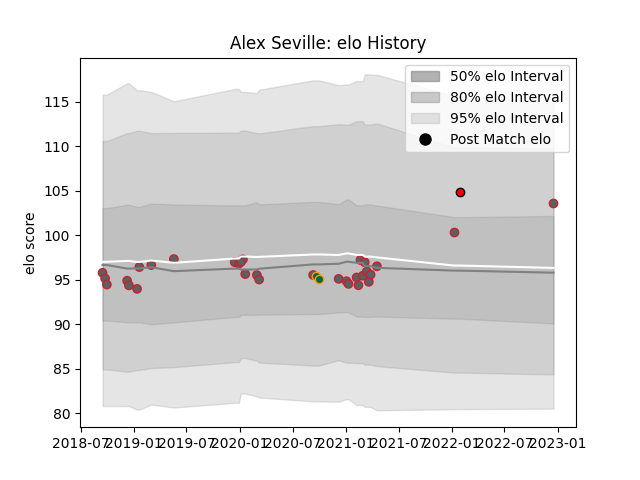

---  
layout: page  
title: Alex Seville  
date: 2022-12-18 16:36:40.275878  
categories: player  
---
# Alex Seville

## Positions: P

## Current elo: 104.0

## Current Percentile: 81.0

# Elo History

# Match History

| Team               |   Appearances |   Win Rate |
|:-------------------|--------------:|-----------:|
| Gloucester Rugby   |            31 |   0.258065 |
| Northampton Saints |             2 |   0        |
| Hartpury College   |             1 |   1        |

| Opponent            |   Matches |   Win Rate |
|:--------------------|----------:|-----------:|
| Exeter Chiefs       |         5 |   0.4      |
| Sale Sharks         |         5 |   0        |
| Bristol Rugby       |         3 |   0.333333 |
| Harlequins          |         3 |   0        |
| Bath Rugby          |         2 |   0.5      |
| Wasps               |         2 |   0.5      |
| Saracens            |         2 |   0.5      |
| Munster             |         1 |   0        |
| Stade Toulousain    |         1 |   0        |
| Northampton Saints  |         1 |   0        |
| Newcastle Falcons   |         1 |   0        |
| London Irish        |         1 |   0        |
| Montpellier Herault |         1 |   1        |
| Bedford             |         1 |   1        |
| Leinster            |         1 |   0        |
| Leicester Tigers    |         1 |   0        |
| Connacht            |         1 |   0        |
| Castres Olympique   |         1 |   0        |
| Worcester Warriors  |         1 |   1        |