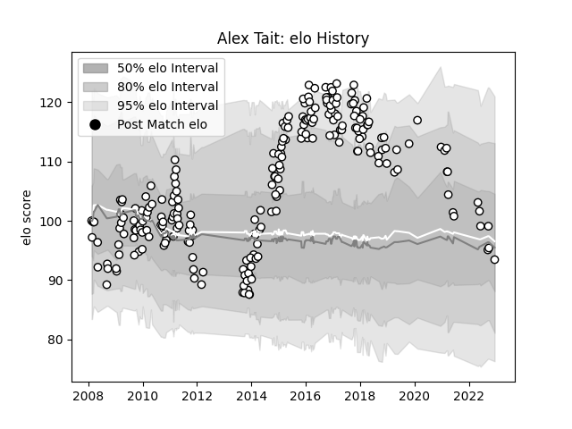

---  
layout: page  
title: Alex Tait  
date: 2023-01-23 15:34:26.726412  
categories: player  
---
# Alex Tait

## Positions: FB, W

## Current elo: 83.0

## Current Percentile: 11.0

# Elo History

# Match History

| Team              |   Appearances |   Win Rate |
|:------------------|--------------:|-----------:|
| Newcastle Falcons |           232 |   0.368534 |

| Opponent             |   Matches |   Win Rate |
|:---------------------|----------:|-----------:|
| Harlequins           |        20 |   0.4      |
| Saracens             |        19 |   0.105263 |
| Sale Sharks          |        17 |   0.411765 |
| Gloucester Rugby     |        17 |   0.352941 |
| Bath Rugby           |        16 |   0.1875   |
| Exeter Chiefs        |        16 |   0.125    |
| Wasps                |        16 |   0.21875  |
| Worcester Warriors   |        15 |   0.3      |
| Northampton Saints   |        15 |   0.4      |
| Leicester Tigers     |        15 |   0.2      |
| London Irish         |        13 |   0.5      |
| Leeds                |         5 |   0.3      |
| Yorkshire Carnegie   |         5 |   0.3      |
| Dragons              |         5 |   0.8      |
| Bristol Rugby        |         5 |   0.6      |
| Brive                |         3 |   0.666667 |
| Connacht             |         3 |   0.666667 |
| Cardiff Blues        |         3 |   0.333333 |
| Hartpury College     |         2 |   1        |
| Bordeaux Begles      |         2 |   1        |
| London Welsh         |         2 |   1        |
| Lyon                 |         2 |   0.5      |
| Montpellier Herault  |         2 |   0.5      |
| Calvisano            |         2 |   1        |
| Ospreys              |         2 |   0        |
| Bourgoin-Jallieu     |         1 |   1        |
| Toulon               |         1 |   1        |
| Stade Francais Paris |         1 |   1        |
| Edinburgh            |         1 |   0        |
| Bucuresti            |         1 |   1        |
| RC Enisei            |         1 |   1        |
| Grenoble             |         1 |   1        |
| London Scottish      |         1 |   1        |
| Jersey               |         1 |   1        |
| Montauban            |         1 |   1        |