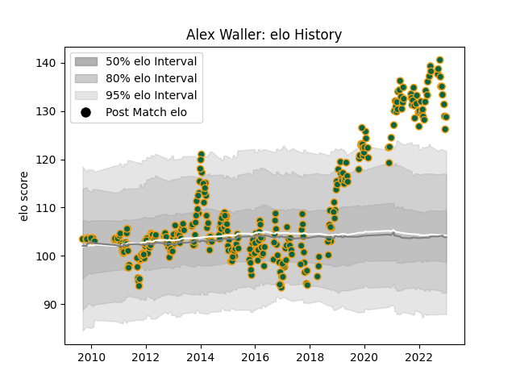

---  
layout: page  
title: Alex Waller  
date: 2023-02-02 19:09:14.474271  
categories: player  
---
# Alex Waller

## Positions: P

## Current elo: 144.0

## Current Percentile: 99.0

# Elo History

# Match History

| Team               |   Appearances |   Win Rate |
|:-------------------|--------------:|-----------:|
| Northampton Saints |           343 |   0.581633 |

| Opponent            |   Matches |   Win Rate |
|:--------------------|----------:|-----------:|
| Saracens            |        29 |   0.396552 |
| Leicester Tigers    |        29 |   0.327586 |
| Exeter Chiefs       |        25 |   0.48     |
| Gloucester Rugby    |        24 |   0.5625   |
| Wasps               |        24 |   0.625    |
| Sale Sharks         |        24 |   0.541667 |
| Harlequins          |        24 |   0.625    |
| Bath Rugby          |        23 |   0.630435 |
| Worcester Warriors  |        21 |   0.857143 |
| Newcastle Falcons   |        19 |   0.684211 |
| London Irish        |        18 |   0.722222 |
| Bristol Rugby       |         9 |   0.555556 |
| Castres Olympique   |         9 |   0.555556 |
| Scarlets            |         7 |   0.857143 |
| Leinster            |         7 |   0.142857 |
| Ospreys             |         6 |   1        |
| Munster             |         5 |   0        |
| Clermont Auvergne   |         5 |   0        |
| Racing 92           |         4 |   0.125    |
| Dragons             |         4 |   1        |
| Glasgow Warriors    |         4 |   0.75     |
| London Welsh        |         4 |   1        |
| Benetton Treviso    |         3 |   1        |
| Ulster              |         3 |   0.666667 |
| Perpignan           |         2 |   1        |
| Lyon                |         2 |   1        |
| Leeds               |         2 |   1        |
| Yorkshire Carnegie  |         2 |   1        |
| Montpellier Herault |         1 |   1        |
| La Rochelle         |         1 |   0        |
| Edinburgh           |         1 |   1        |
| Timisoara Saracens  |         1 |   1        |
| Cardiff Blues       |         1 |   1        |