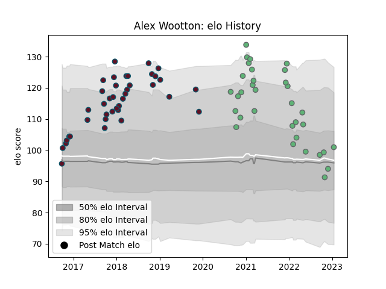

---  
layout: page  
title: Alex Wootton  
date: 2023-01-17 11:31:01.308375  
categories: player  
---
# Alex Wootton

## Positions: W

## Current elo: 101.0

## Current Percentile: 44.0

# Elo History

# Match History

| Team     |   Appearances |   Win Rate |
|:---------|--------------:|-----------:|
| Munster  |            39 |   0.769231 |
| Connacht |            33 |   0.515152 |

| Opponent             |   Matches |   Win Rate |
|:---------------------|----------:|-----------:|
| Zebre                |         7 |   1        |
| Ulster               |         7 |   0.428571 |
| Edinburgh            |         6 |   0.333333 |
| Ospreys              |         6 |   0.833333 |
| Glasgow Warriors     |         6 |   0.666667 |
| Benetton Treviso     |         5 |   1        |
| Cardiff Blues        |         4 |   0.75     |
| Leinster             |         4 |   0.25     |
| Scarlets             |         4 |   0.5      |
| Leicester Tigers     |         3 |   0.666667 |
| Munster              |         3 |   0        |
| Dragons              |         2 |   1        |
| Connacht             |         2 |   1        |
| Stade Francais Paris |         2 |   0.5      |
| Racing 92            |         2 |   0        |
| Cheetahs             |         2 |   1        |
| Castres Olympique    |         1 |   1        |
| Sharks               |         1 |   0        |
| Southern Kings       |         1 |   1        |
| Brive                |         1 |   1        |
| Stormers             |         1 |   1        |
| Toulon               |         1 |   1        |
| Lions                |         1 |   1        |