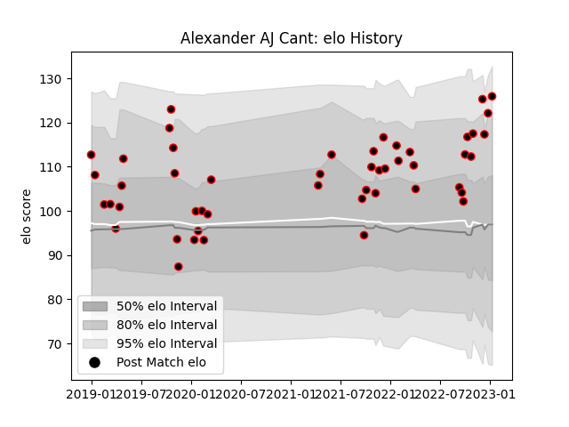

---  
layout: page  
title: Alexander AJ Cant  
date: 2022-12-31 16:25:53.992107  
categories: player  
---
# Alexander AJ Cant

## Positions: W, FB

## Current elo: 126.0

## Current Percentile: 97.0

# Elo History

# Match History

| Team            |   Appearances |   Win Rate |
|:----------------|--------------:|-----------:|
| Cornish Pirates |            48 |    0.59375 |

| Opponent            |   Matches |   Win Rate |
|:--------------------|----------:|-----------:|
| Ealing Trailfinders |         6 |   0.333333 |
| Nottingham          |         6 |   1        |
| Ampthill            |         5 |   0.9      |
| Doncaster           |         5 |   0.8      |
| London Scottish     |         5 |   0.6      |
| Jersey              |         4 |   0.25     |
| Bedford             |         3 |   0.666667 |
| Coventry            |         3 |   0.666667 |
| Yorkshire Carnegie  |         3 |   0.666667 |
| Hartpury College    |         2 |   0        |
| Newcastle Falcons   |         2 |   0        |
| Richmond            |         2 |   1        |
| Caldy               |         1 |   0        |
| London Irish        |         1 |   0        |