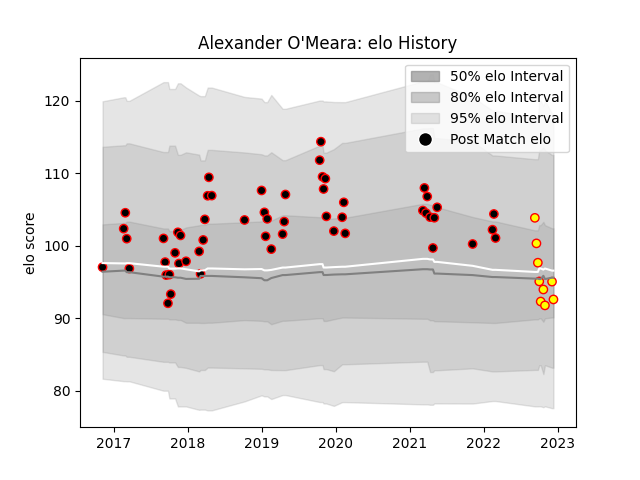

---  
layout: page  
title: Alexander O'Meara  
date: 2022-12-14 11:26:57.801868  
categories: player  
---
# Alexander O'Meara

## Positions: W

## Current elo: 93.0

## Current Percentile: 46.0

# Elo History

# Match History

| Team            |   Appearances |   Win Rate |
|:----------------|--------------:|-----------:|
| Cornish Pirates |            54 |   0.611111 |
| Richmond        |             9 |   0.277778 |

| Opponent            |   Matches |   Win Rate |
|:--------------------|----------:|-----------:|
| Doncaster           |         7 |   0.714286 |
| London Scottish     |         7 |   0.571429 |
| Hartpury College    |         6 |   1        |
| Ealing Trailfinders |         6 |   0.333333 |
| Jersey              |         5 |   0.2      |
| Yorkshire Carnegie  |         5 |   0.6      |
| Bedford             |         4 |   1        |
| Nottingham          |         4 |   0.5      |
| Coventry            |         3 |   0.333333 |
| Richmond            |         3 |   1        |
| Ampthill            |         3 |   0.5      |
| Bristol Rugby       |         2 |   0        |
| Newcastle Falcons   |         2 |   0        |
| Rotherham Titans    |         2 |   1        |
| Cornish Pirates     |         1 |   0        |
| Caldy               |         1 |   0        |
| London Irish        |         1 |   0        |
| Saracens            |         1 |   1        |