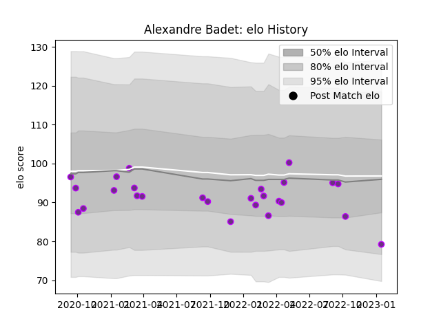

---  
layout: page  
title: Alexandre Badet  
date: 2023-02-02 19:14:26.843469  
categories: player  
---
# Alexandre Badet

## Positions: C

## Current elo: 77.0

## Current Percentile: 12.0

# Elo History

# Match History

| Team        |   Appearances |   Win Rate |
|:------------|--------------:|-----------:|
| US Bressane |            27 |   0.518519 |

| Opponent                   |   Matches |   Win Rate |
|:---------------------------|----------:|-----------:|
| Blagnac                    |         3 |   0.666667 |
| Chambery                   |         3 |   0.666667 |
| Nevers                     |         2 |   0        |
| Agen                       |         1 |   1        |
| Massy                      |         1 |   0        |
| Tarbes                     |         1 |   0        |
| Suresnes                   |         1 |   1        |
| Rouen                      |         1 |   0.5      |
| Rennes                     |         1 |   1        |
| Nice                       |         1 |   0        |
| Montauban                  |         1 |   0.5      |
| Mont-de-Marsan             |         1 |   0        |
| Dax                        |         1 |   0        |
| Albi                       |         1 |   1        |
| Colomiers                  |         1 |   1        |
| Cognac Saint Jean d'Angély |         1 |   1        |
| Carcassonne                |         1 |   0        |
| Bourgoin-Jallieu           |         1 |   1        |
| Beziers                    |         1 |   1        |
| Bayonne                    |         1 |   0        |
| Aurillac                   |         1 |   1        |
| Vannes                     |         1 |   0        |