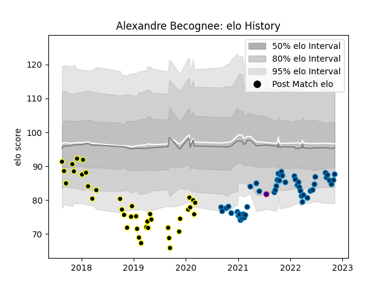

---  
layout: page  
title: Alexandre Becognee  
date: 2023-02-02 18:48:03.308928  
categories: player  
---
# Alexandre Becognee

## Positions: FL, N8

## Country: France

## Current elo: 82.0

## Current Percentile: 16.0

# Elo History

# Match History

| Team                |   Appearances |   Win Rate |
|:--------------------|--------------:|-----------:|
| Montpellier Herault |            57 |   0.535088 |
| Mont-de-Marsan      |            56 |   0.526786 |
| France              |             1 |   0        |

| Opponent             |   Matches |   Win Rate |
|:---------------------|----------:|-----------:|
| Brive                |         7 |   0.642857 |
| Stade Toulousain     |         6 |   0.166667 |
| La Rochelle          |         5 |   0.6      |
| Racing 92            |         5 |   0.6      |
| Bayonne              |         5 |   0.7      |
| Carcassonne          |         5 |   0.8      |
| Castres Olympique    |         5 |   0.4      |
| Colomiers            |         5 |   0.4      |
| Aurillac             |         5 |   0.6      |
| Lyon                 |         4 |   0.25     |
| Provence Rugby       |         4 |   0.25     |
| Perpignan            |         4 |   1        |
| Nevers               |         4 |   0.5      |
| Vannes               |         4 |   0.25     |
| Bordeaux Begles      |         4 |   0.5      |
| Biarritz Olympique   |         4 |   0.5      |
| Beziers              |         4 |   0.5      |
| Stade Francais Paris |         4 |   1        |
| Toulon               |         3 |   0.666667 |
| Montauban            |         3 |   0.666667 |
| Clermont Auvergne    |         3 |   0.333333 |
| Pau                  |         3 |   0.333333 |
| Soyaux-Angouleme     |         2 |   0.5      |
| Grenoble             |         2 |   0        |
| Dax                  |         2 |   1        |
| Narbonne             |         2 |   0.5      |
| Ospreys              |         2 |   0        |
| US Bressane          |         2 |   0.5      |
| Agen                 |         1 |   1        |
| Rouen                |         1 |   1        |
| Oyonnax              |         1 |   0        |
| London Irish         |         1 |   1        |
| Australia            |         1 |   0        |
| Massy                |         1 |   1        |