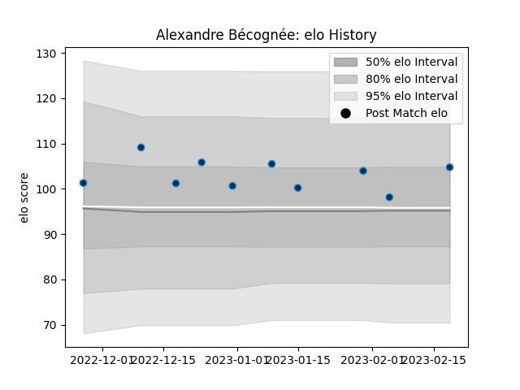

---  
layout: page  
title: Alexandre Bécognée  
date: 2023-02-24 02:29:47.421881  
categories: player  
---
# Alexandre Bécognée

## Positions: FL

## Current elo: 105.0

## Current Percentile: 58.0

# Elo History

# Match History

| Team                |   Appearances |   Win Rate |
|:--------------------|--------------:|-----------:|
| Montpellier Herault |            10 |        0.4 |

| Opponent         |   Matches |   Win Rate |
|:-----------------|----------:|-----------:|
| Ospreys          |         2 |          0 |
| Bayonne          |         1 |          1 |
| Bordeaux Begles  |         1 |          0 |
| London Irish     |         1 |          1 |
| Lyon             |         1 |          0 |
| Perpignan        |         1 |          1 |
| Racing 92        |         1 |          1 |
| Stade Toulousain |         1 |          0 |
| Toulon           |         1 |          0 |