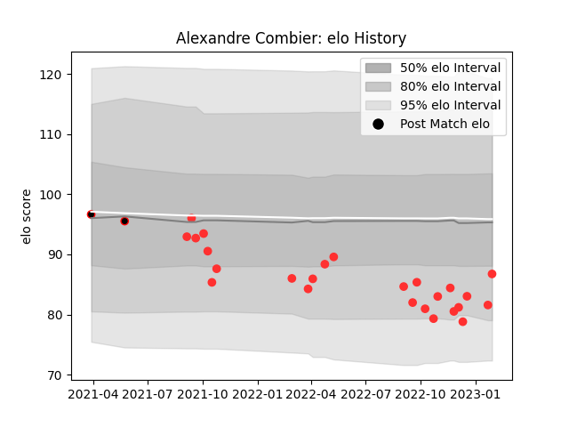

---  
layout: page  
title: Alexandre Combier  
date: 2023-03-17 17:05:26.196186  
categories: player  
---
# Alexandre Combier

## Positions: P

## Current elo: 86.0

## Current Percentile: 37.0

# Elo History

# Match History

| Team   |   Appearances |   Win Rate |
|:-------|--------------:|-----------:|
| Tarbes |            29 |        0.5 |
| Nice   |             2 |        0.5 |

| Opponent                   |   Matches |   Win Rate |
|:---------------------------|----------:|-----------:|
| Nice                       |         4 |   0.25     |
| Blagnac                    |         3 |   0.166667 |
| Bourgoin-Jallieu           |         3 |   0.666667 |
| Chambery                   |         3 |   0.666667 |
| Albi                       |         2 |   1        |
| Dax                        |         2 |   0        |
| Rennes                     |         2 |   1        |
| Dijon                      |         2 |   1        |
| Carqueiranne-Hyères        |         2 |   0.5      |
| Aubenas                    |         1 |   0        |
| Massy                      |         1 |   0        |
| Narbonne                   |         1 |   1        |
| Cognac Saint Jean d'Angély |         1 |   1        |
| Soyaux-Angouleme           |         1 |   1        |
| Suresnes                   |         1 |   0        |
| US Bressane                |         1 |   0        |
| Valence Romans Drome Rugby |         1 |   0        |