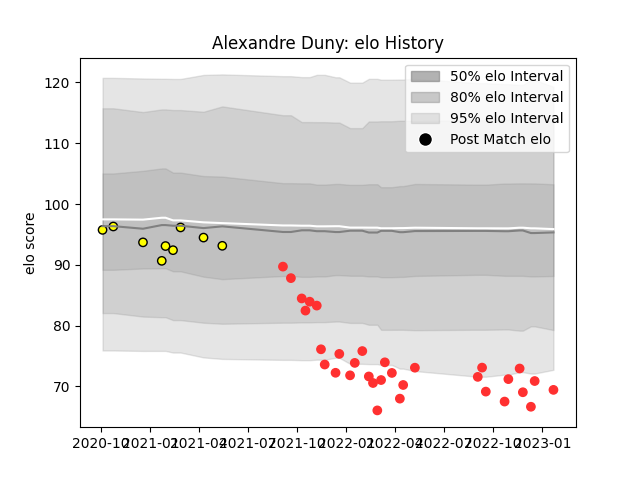

---  
layout: page  
title: Alexandre Duny  
date: 2023-01-23 15:31:39.555163  
categories: player  
---
# Alexandre Duny

## Positions: P

## Current elo: 69.0

## Current Percentile: 4.0

# Elo History

# Match History

| Team        |   Appearances |   Win Rate |
|:------------|--------------:|-----------:|
| Tarbes      |            32 |   0.4375   |
| Carcassonne |             9 |   0.444444 |

| Opponent                   |   Matches |   Win Rate |
|:---------------------------|----------:|-----------:|
| Valence Romans Drome Rugby |         4 |   0.25     |
| Chambery                   |         4 |   0.5      |
| Soyaux-Angouleme           |         4 |   0.75     |
| Nice                       |         3 |   0        |
| Cognac Saint Jean d'Angély |         3 |   1        |
| Albi                       |         3 |   0.666667 |
| Blagnac                    |         3 |   0.166667 |
| Bourgoin-Jallieu           |         2 |   1        |
| Dax                        |         2 |   0.5      |
| Aubenas                    |         2 |   0.5      |
| Rouen                      |         2 |   1        |
| Massy                      |         2 |   0        |
| Dijon                      |         1 |   0.5      |
| Mont-de-Marsan             |         1 |   0        |
| Oyonnax                    |         1 |   0        |
| Perpignan                  |         1 |   0        |
| Beziers                    |         1 |   0        |
| Suresnes                   |         1 |   0        |
| US Bressane                |         1 |   0        |