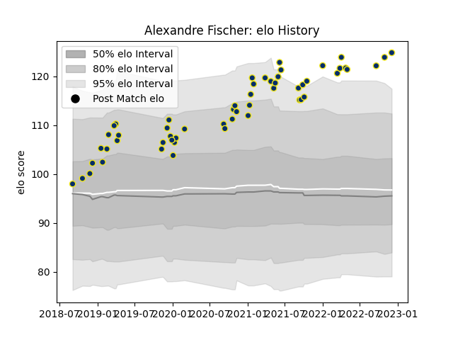

---  
layout: page  
title: Alexandre Fischer  
date: 2023-01-13 11:23:23.728375  
categories: player  
---
# Alexandre Fischer

## Positions: FL

## Current elo: 126.0

## Current Percentile: 97.0

# Elo History

# Match History

| Team              |   Appearances |   Win Rate |
|:------------------|--------------:|-----------:|
| Clermont Auvergne |            60 |        0.6 |

| Opponent             |   Matches |   Win Rate |
|:---------------------|----------:|-----------:|
| Castres Olympique    |         6 |   0.333333 |
| Stade Toulousain     |         6 |   0.333333 |
| Racing 92            |         6 |   0.416667 |
| Bordeaux Begles      |         5 |   0.5      |
| Toulon               |         4 |   0.25     |
| Lyon                 |         4 |   0.25     |
| Agen                 |         3 |   1        |
| Brive                |         3 |   0.666667 |
| La Rochelle          |         3 |   0.666667 |
| Stade Francais Paris |         3 |   1        |
| Pau                  |         2 |   1        |
| Timisoara Saracens   |         2 |   1        |
| Montpellier Herault  |         2 |   1        |
| Bath Rugby           |         2 |   1        |
| Harlequins           |         2 |   1        |
| Northampton Saints   |         1 |   1        |
| Perpignan            |         1 |   1        |
| Leicester Tigers     |         1 |   0        |
| Stormers             |         1 |   1        |
| Dragons              |         1 |   1        |
| Bayonne              |         1 |   0        |
| Ulster               |         1 |   1        |