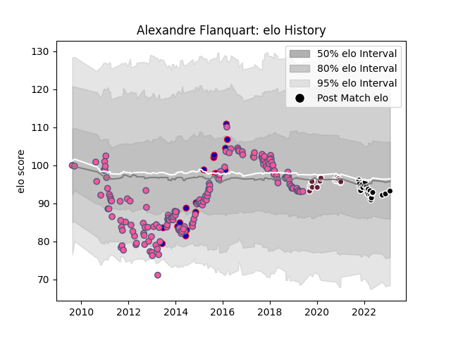

---  
layout: page  
title: Alexandre Flanquart  
date: 2023-02-04 18:26:44.311045  
categories: player  
---
# Alexandre Flanquart

## Positions: L

## Country: France

## Current elo: 93.0

## Current Percentile: 40.0

# Elo History

# Match History

| Team                 |   Appearances |   Win Rate |
|:---------------------|--------------:|-----------:|
| Stade Francais Paris |           166 |   0.509036 |
| France               |            23 |   0.478261 |
| Provence Rugby       |            23 |   0.695652 |
| Bordeaux Begles      |            22 |   0.636364 |

| Opponent             |   Matches |   Win Rate |
|:---------------------|----------:|-----------:|
| Montpellier Herault  |        15 |   0.533333 |
| Toulon               |        14 |   0.392857 |
| Clermont Auvergne    |        14 |   0.535714 |
| Racing 92            |        13 |   0.461538 |
| Castres Olympique    |        12 |   0.625    |
| Lyon                 |        11 |   0.272727 |
| Bayonne              |        11 |   0.545455 |
| Grenoble             |        10 |   0.7      |
| Agen                 |        10 |   0.7      |
| Brive                |        10 |   0.5      |
| Bordeaux Begles      |        10 |   0.5      |
| Stade Toulousain     |         9 |   0.277778 |
| Oyonnax              |         8 |   0.5625   |
| La Rochelle          |         7 |   0.571429 |
| Pau                  |         7 |   0.428571 |
| Biarritz Olympique   |         6 |   0.666667 |
| England              |         5 |   0.4      |
| Perpignan            |         4 |   0.75     |
| Mont-de-Marsan       |         4 |   1        |
| Australia            |         4 |   0.25     |
| Ireland              |         3 |   0.333333 |
| Italy                |         3 |   1        |
| Bourgoin-Jallieu     |         3 |   1        |
| Scotland             |         3 |   0.666667 |
| Wasps                |         3 |   0.333333 |
| Edinburgh            |         3 |   0.5      |
| New Zealand          |         2 |   0        |
| Bucuresti            |         2 |   1        |
| Carcassonne          |         2 |   1        |
| US Bressane          |         2 |   0.75     |
| Leicester Tigers     |         2 |   0        |
| Montauban            |         2 |   1        |
| Vannes               |         2 |   0.5      |
| Aurillac             |         2 |   0.5      |
| London Irish         |         2 |   0.5      |
| Stade Francais Paris |         2 |   0.5      |
| Wales                |         1 |   0        |
| Worcester Warriors   |         1 |   0        |
| Lusitanos XV         |         1 |   1        |
| Rouen                |         1 |   0        |
| Romania              |         1 |   1        |
| Ospreys              |         1 |   0        |
| Narbonne             |         1 |   0        |
| Fiji                 |         1 |   1        |
| Exeter Chiefs        |         1 |   1        |
| Crociati Rugby       |         1 |   1        |
| Beziers              |         1 |   1        |
| Yorkshire Carnegie   |         1 |   1        |