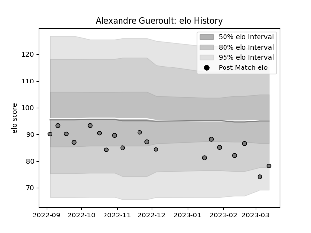

---  
layout: page  
title: Alexandre Gueroult  
date: 2023-03-21 18:31:37.287239  
categories: player  
---
# Alexandre Gueroult

Last updated: 2023-03-21
## Positions: L

## Current elo: 78.0

## Current Percentile: 8.0

# Elo History

# Match History

| Team   |   Appearances |   Win Rate |
|:-------|--------------:|-----------:|
| Rennes |            19 |   0.210526 |

| Opponent                   |   Matches |   Win Rate |
|:---------------------------|----------:|-----------:|
| Albi                       |         2 |        0   |
| Blagnac                    |         2 |        0   |
| Chambery                   |         2 |        0.5 |
| Cognac Saint Jean d'Angély |         2 |        1   |
| Tarbes                     |         2 |        0   |
| US Bressane                |         2 |        0   |
| Valence Romans Drome Rugby |         2 |        0   |
| Carqueiranne-Hyères        |         1 |        1   |
| Dax                        |         1 |        0   |
| Narbonne                   |         1 |        0   |
| Nice                       |         1 |        0   |
| Suresnes                   |         1 |        0   |