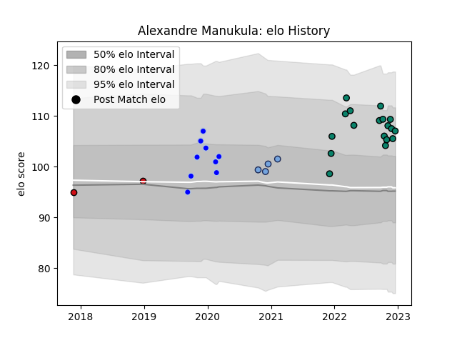

---  
layout: page  
title: Alexandre Manukula  
date: 2022-12-12 15:28:50.550411  
categories: player  
---
# Alexandre Manukula

## Positions: L

## Current elo: 106.0

## Current Percentile: 84.0

# Elo History

# Match History

| Team             |   Appearances |   Win Rate |
|:-----------------|--------------:|-----------:|
| Montauban        |            17 |   0.411765 |
| Colomiers        |             9 |   0.666667 |
| Bayonne          |             4 |   0.125    |
| Stade Toulousain |             2 |   0.25     |

| Opponent            |   Matches |   Win Rate |
|:--------------------|----------:|-----------:|
| Aurillac            |         4 |   0.5      |
| Mont-de-Marsan      |         3 |   0.333333 |
| Nevers              |         2 |   1        |
| Beziers             |         2 |   0.5      |
| Biarritz Olympique  |         2 |   0.5      |
| Rouen               |         2 |   0.5      |
| Provence Rugby      |         2 |   0.5      |
| Grenoble            |         2 |   0.25     |
| Agen                |         1 |   1        |
| Vannes              |         1 |   0.5      |
| Racing 92           |         1 |   0        |
| Perpignan           |         1 |   0        |
| Oyonnax             |         1 |   0        |
| Massy               |         1 |   1        |
| Montpellier Herault |         1 |   0        |
| Lyon                |         1 |   0        |
| Colomiers           |         1 |   1        |
| Clermont Auvergne   |         1 |   0.5      |
| Castres Olympique   |         1 |   0        |
| Bayonne             |         1 |   0        |
| Zebre               |         1 |   0.5      |