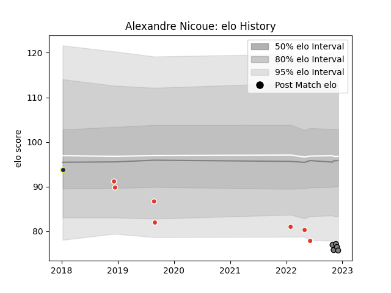

---  
layout: page  
title: Alexandre Nicoue  
date: 2022-11-22 11:47:43.304416  
categories: player  
---
# Alexandre Nicoue

## Positions: W

## Current elo: 78.0

## Current Percentile: 3.0

# Elo History

# Match History

| Team               |   Appearances |   Win Rate |
|:-------------------|--------------:|-----------:|
| Biarritz Olympique |             7 |   0.142857 |
| Rennes             |             3 |   0.333333 |
| Clermont Auvergne  |             1 |   0        |

| Opponent            |   Matches |   Win Rate |
|:--------------------|----------:|-----------:|
| Vannes              |         2 |        0.5 |
| Aurillac            |         1 |        0   |
| Beziers             |         1 |        0   |
| Blagnac             |         1 |        0   |
| Brive               |         1 |        0   |
| Carqueiranne-Hyères |         1 |        1   |
| Castres Olympique   |         1 |        0   |
| Dax                 |         1 |        0   |
| Racing 92           |         1 |        0   |
| Stade Toulousain    |         1 |        0   |