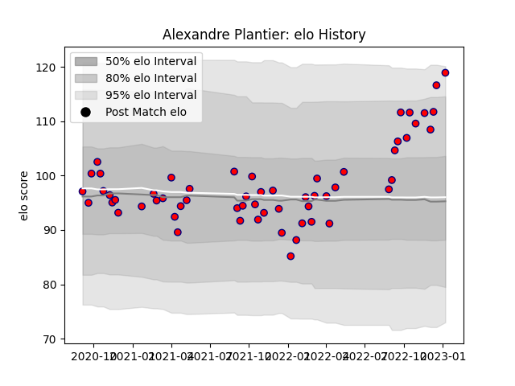

---  
layout: page  
title: Alexandre Plantier  
date: 2023-01-13 11:31:15.404973  
categories: player  
---
# Alexandre Plantier

## Positions: P

## Current elo: 119.0

## Current Percentile: 92.0

# Elo History

# Match History

| Team     |   Appearances |   Win Rate |
|:---------|--------------:|-----------:|
| Aurillac |            58 |   0.525862 |

| Opponent           |   Matches |   Win Rate |
|:-------------------|----------:|-----------:|
| Montauban          |         5 |   0.6      |
| Mont-de-Marsan     |         5 |   0.2      |
| Provence Rugby     |         5 |   0.6      |
| Colomiers          |         5 |   0.6      |
| Nevers             |         5 |   0.6      |
| Beziers            |         4 |   0.5      |
| Rouen              |         4 |   0.75     |
| Grenoble           |         4 |   0.25     |
| Agen               |         3 |   0.333333 |
| Vannes             |         3 |   0.666667 |
| Narbonne           |         2 |   1        |
| Oyonnax            |         2 |   0.5      |
| Perpignan          |         2 |   0.25     |
| Biarritz Olympique |         2 |   0        |
| Soyaux-Angouleme   |         2 |   1        |
| US Bressane        |         2 |   0.5      |
| Bayonne            |         1 |   0        |
| Massy              |         1 |   1        |
| Carcassonne        |         1 |   1        |