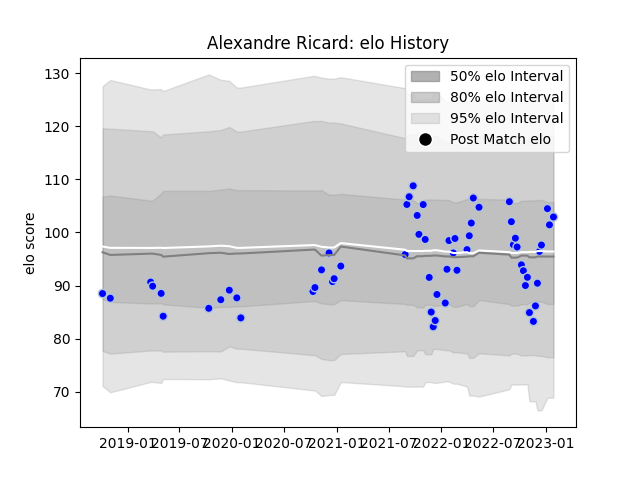

---  
layout: page  
title: Alexandre Ricard  
date: 2023-01-13 11:34:59.621477  
categories: player  
---
# Alexandre Ricard

## Positions: L

## Current elo: 104.0

## Current Percentile: 51.0

# Elo History

# Match History

| Team      |   Appearances |   Win Rate |
|:----------|--------------:|-----------:|
| Colomiers |            58 |   0.586207 |

| Opponent           |   Matches |   Win Rate |
|:-------------------|----------:|-----------:|
| Carcassonne        |         7 |   0.571429 |
| Provence Rugby     |         6 |   0.5      |
| Vannes             |         4 |   0.25     |
| Aurillac           |         4 |   0.5      |
| Mont-de-Marsan     |         4 |   0.25     |
| Montauban          |         3 |   0.333333 |
| Soyaux-Angouleme   |         3 |   1        |
| Oyonnax            |         3 |   0.666667 |
| Nevers             |         3 |   0.666667 |
| Agen               |         3 |   0.666667 |
| Beziers            |         3 |   0.666667 |
| Bayonne            |         3 |   0.333333 |
| Grenoble           |         2 |   1        |
| Biarritz Olympique |         2 |   0.5      |
| Rouen              |         2 |   0.5      |
| Narbonne           |         2 |   1        |
| Massy              |         1 |   1        |
| Perpignan          |         1 |   1        |
| Roval Drome XV     |         1 |   1        |
| US Bressane        |         1 |   1        |