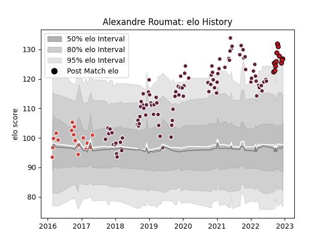

---  
layout: page  
title: Alexandre Roumat  
date: 2022-12-14 11:25:24.096403  
categories: player  
---
# Alexandre Roumat

## Positions: FL, N8

## Current elo: 127.0

## Current Percentile: 95.0

# Elo History

# Match History

| Team               |   Appearances |   Win Rate |
|:-------------------|--------------:|-----------:|
| Bordeaux Begles    |            96 |   0.572917 |
| Biarritz Olympique |            18 |   0.722222 |
| Stade Toulousain   |            12 |   0.791667 |

| Opponent             |   Matches |   Win Rate |
|:---------------------|----------:|-----------:|
| Agen                 |         9 |   0.777778 |
| La Rochelle          |         8 |   0.375    |
| Stade Toulousain     |         8 |   0.125    |
| Racing 92            |         8 |   0.625    |
| Castres Olympique    |         8 |   0.8125   |
| Lyon                 |         8 |   0.5      |
| Toulon               |         7 |   0.571429 |
| Stade Francais Paris |         7 |   0.5      |
| Perpignan            |         7 |   0.928571 |
| Clermont Auvergne    |         7 |   0.857143 |
| Montpellier Herault  |         7 |   0.642857 |
| Pau                  |         5 |   0.4      |
| Bayonne              |         3 |   1        |
| Brive                |         3 |   0.833333 |
| Oyonnax              |         2 |   0.5      |
| Newcastle Falcons    |         2 |   0        |
| Grenoble             |         2 |   0.5      |
| Wasps                |         2 |   1        |
| Bourgoin-Jallieu     |         2 |   1        |
| Dragons              |         2 |   0.5      |
| Aurillac             |         2 |   0.5      |
| Biarritz Olympique   |         2 |   0.5      |
| Tarbes               |         1 |   1        |
| Beziers              |         1 |   1        |
| Bordeaux Begles      |         1 |   1        |
| RC Enisei            |         1 |   1        |
| Provence Rugby       |         1 |   1        |
| Edinburgh            |         1 |   1        |
| Albi                 |         1 |   0        |
| Carcassonne          |         1 |   1        |
| Colomiers            |         1 |   1        |
| Narbonne             |         1 |   0        |
| Munster              |         1 |   1        |
| Connacht             |         1 |   0        |
| Mont-de-Marsan       |         1 |   1        |
| Dax                  |         1 |   0        |
| Bristol Rugby        |         1 |   0        |