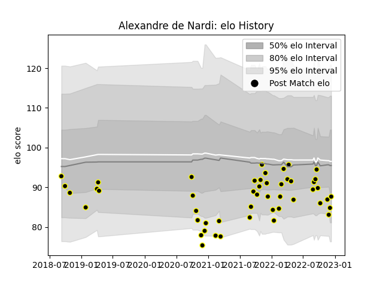

---  
layout: page  
title: Alexandre de Nardi  
date: 2022-12-09 13:04:27.918900  
categories: player  
---
# Alexandre de Nardi

## Positions: FB, W

## Current elo: 85.0

## Current Percentile: 9.0

# Elo History

# Match History

| Team           |   Appearances |   Win Rate |
|:---------------|--------------:|-----------:|
| Mont-de-Marsan |            48 |   0.552083 |

| Opponent           |   Matches |   Win Rate |
|:-------------------|----------:|-----------:|
| Montauban          |         5 |   0.2      |
| Provence Rugby     |         5 |   0.4      |
| Grenoble           |         4 |   0.25     |
| Nevers             |         4 |   0.5      |
| Soyaux-Angouleme   |         3 |   0.666667 |
| Oyonnax            |         3 |   0.666667 |
| Aurillac           |         3 |   0.666667 |
| Vannes             |         3 |   0.666667 |
| Colomiers          |         2 |   0        |
| Biarritz Olympique |         2 |   0.75     |
| Beziers            |         2 |   0.5      |
| Bayonne            |         2 |   1        |
| US Bressane        |         2 |   1        |
| Agen               |         2 |   1        |
| Massy              |         1 |   1        |
| Carcassonne        |         1 |   1        |
| Narbonne           |         1 |   1        |
| Brive              |         1 |   0        |
| Perpignan          |         1 |   0        |
| Rouen              |         1 |   1        |