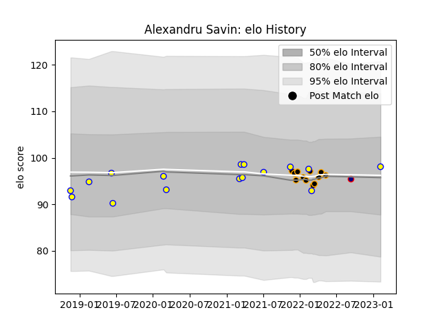

---  
layout: page  
title: Alexandru Savin  
date: 2023-02-05 15:12:26.502467  
categories: player  
---
# Alexandru Savin

## Positions: P

## Country: Romania

## Current elo: 98.0

## Current Percentile: 48.0

# Elo History

# Match History

| Team            |   Appearances |   Win Rate |
|:----------------|--------------:|-----------:|
| Romania         |            16 |   0.5625   |
| Chambery        |            12 |   0.416667 |
| Romanian Wolves |             1 |   0        |

| Opponent                   |   Matches |   Win Rate |
|:---------------------------|----------:|-----------:|
| Spain                      |         3 |   0.666667 |
| Cognac Saint Jean d'Angély |         2 |   0.5      |
| Dijon                      |         2 |   1        |
| Russia                     |         2 |   0        |
| Massy                      |         2 |   0        |
| Portugal                   |         2 |   1        |
| Argentina                  |         1 |   0        |
| Poland                     |         1 |   1        |
| Uruguay                    |         1 |   0        |
| United States of America   |         1 |   0        |
| Tel-Aviv Heat              |         1 |   0        |
| Soyaux-Angouleme           |         1 |   1        |
| Netherlands                |         1 |   1        |
| Nice                       |         1 |   0        |
| Aubenas                    |         1 |   0        |
| Germany                    |         1 |   1        |
| Georgia                    |         1 |   0        |
| Chile                      |         1 |   1        |
| Brazil                     |         1 |   1        |
| Bourgoin-Jallieu           |         1 |   1        |
| Blagnac                    |         1 |   0        |
| Valence Romans Drome Rugby |         1 |   0        |