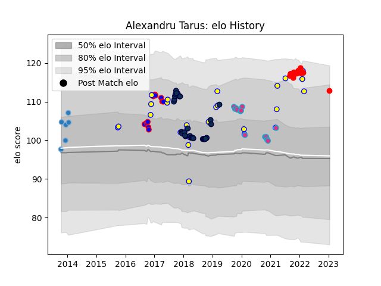

---  
layout: page  
title: Alexandru Tarus  
date: 2023-01-15 11:49:54.610936  
categories: player  
---
# Alexandru Tarus

## Positions: P

## Country: Romania

## Current elo: 113.0

## Current Percentile: 88.0

# Elo History

# Match History

| Team        |   Appearances |   Win Rate |
|:------------|--------------:|-----------:|
| Sale Sharks |            31 |  0.419355  |
| Romania     |            26 |  0.538462  |
| Zebre       |            15 |  0.0666667 |
| Rouen       |            14 |  0.392857  |
| Beziers     |            11 |  0.363636  |
| Bucuresti   |             6 |  0.333333  |

| Opponent                 |   Matches |   Win Rate |
|:-------------------------|----------:|-----------:|
| Newcastle Falcons        |         5 |   0.2      |
| Spain                    |         4 |   0.25     |
| Russia                   |         4 |   0.75     |
| Leinster                 |         3 |   0        |
| Canada                   |         3 |   1        |
| Georgia                  |         3 |   0        |
| Montauban                |         3 |   0        |
| Narbonne                 |         3 |   0.333333 |
| Connacht                 |         3 |   0.666667 |
| Colomiers                |         3 |   0.333333 |
| Leicester Tigers         |         3 |   0        |
| Portugal                 |         3 |   0.666667 |
| Brive                    |         3 |   0        |
| Wasps                    |         3 |   0.333333 |
| Harlequins               |         2 |   0        |
| Oyonnax                  |         2 |   0.5      |
| Saracens                 |         2 |   0.5      |
| Scarlets                 |         2 |   0        |
| Soyaux-Angouleme         |         2 |   1        |
| Lyon                     |         2 |   0.5      |
| Albi                     |         2 |   0.5      |
| Perpignan                |         2 |   0.5      |
| Worcester Warriors       |         2 |   1        |
| Calvisano                |         2 |   1        |
| Germany                  |         2 |   1        |
| Bordeaux Begles          |         2 |   0.5      |
| Cardiff Blues            |         2 |   0.5      |
| Exeter Chiefs            |         2 |   0        |
| Benetton Treviso         |         2 |   0        |
| Glasgow Warriors         |         2 |   0        |
| Uruguay                  |         1 |   1        |
| United States of America |         1 |   1        |
| Belgium                  |         1 |   1        |
| US Bressane              |         1 |   0.5      |
| Tonga                    |         1 |   0        |
| Stade Toulousain         |         1 |   0        |
| Stade Francais Paris     |         1 |   1        |
| Vannes                   |         1 |   1        |
| Bath Rugby               |         1 |   0        |
| Bayonne                  |         1 |   0        |
| Argentina                |         1 |   0        |
| Ulster                   |         1 |   0        |
| Grenoble                 |         1 |   1        |
| Ireland                  |         1 |   0        |
| Carcassonne              |         1 |   0        |
| Northampton Saints       |         1 |   0        |
| Dax                      |         1 |   0        |
| Nevers                   |         1 |   0        |
| Edinburgh                |         1 |   0        |
| Munster                  |         1 |   0        |
| Mont-de-Marsan           |         1 |   0        |
| London Irish             |         1 |   1        |
| Gloucester Rugby         |         1 |   1        |
| Japan                    |         1 |   0        |
| Agen                     |         1 |   1        |