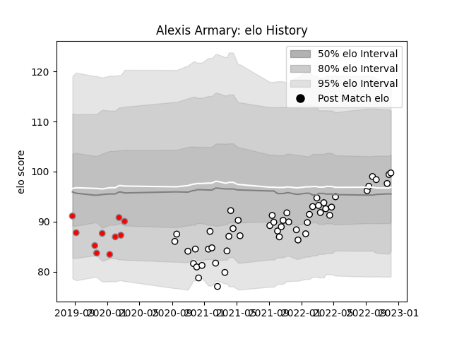

---  
layout: page  
title: Alexis Armary  
date: 2023-03-17 17:21:56.372640  
categories: player  
---
# Alexis Armary

## Positions: FL

## Current elo: 120.0

## Current Percentile: 90.0

# Elo History

# Match History

| Team                       |   Appearances |   Win Rate |
|:---------------------------|--------------:|-----------:|
| Valence Romans Drome Rugby |            61 |    0.54918 |
| Roval Drome XV             |            10 |    0       |
| Tarbes                     |             6 |    0.5     |

| Opponent                   |   Matches |   Win Rate |
|:---------------------------|----------:|-----------:|
| Soyaux-Angouleme           |         7 |   0.214286 |
| Blagnac                    |         4 |   0.5      |
| Provence Rugby             |         4 |   0.25     |
| Perpignan                  |         4 |   0        |
| Dax                        |         4 |   0.25     |
| Tarbes                     |         3 |   0.666667 |
| Beziers                    |         3 |   0.166667 |
| Cognac Saint Jean d'Angély |         3 |   1        |
| Oyonnax                    |         3 |   0        |
| Nevers                     |         3 |   0.333333 |
| Narbonne                   |         3 |   1        |
| Montauban                  |         3 |   0.333333 |
| Albi                       |         2 |   0.5      |
| Mont-de-Marsan             |         2 |   0.25     |
| Suresnes                   |         2 |   1        |
| Rouen                      |         2 |   0.5      |
| Massy                      |         2 |   0        |
| Aubenas                    |         2 |   1        |
| Grenoble                   |         2 |   0        |
| Dijon                      |         2 |   0.5      |
| Chambery                   |         2 |   1        |
| Carqueiranne-Hyères        |         2 |   1        |
| Carcassonne                |         2 |   1        |
| Bourgoin-Jallieu           |         2 |   1        |
| Aurillac                   |         2 |   0.5      |
| Vannes                     |         2 |   0.5      |
| Nice                       |         1 |   1        |
| Colomiers                  |         1 |   0        |
| Rennes                     |         1 |   1        |
| Bayonne                    |         1 |   1        |
| US Bressane                |         1 |   0        |