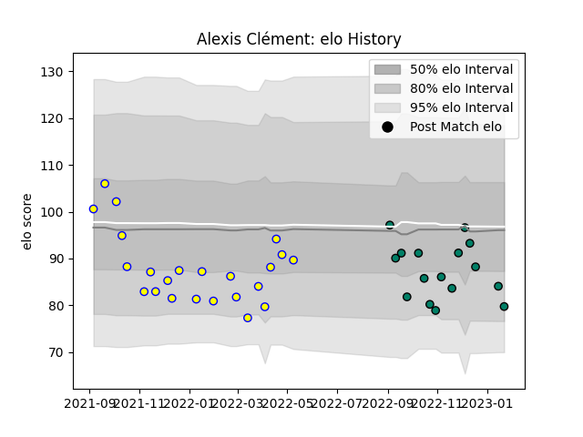

---  
layout: page  
title: Alexis Clément  
date: 2023-03-16 20:14:34.515328  
categories: player  
---
# Alexis Clément

## Positions: W

## Current elo: 80.0

## Current Percentile: 42.0

# Elo History

# Match History

| Team     |   Appearances |   Win Rate |
|:---------|--------------:|-----------:|
| Aubenas  |            23 |   0.326087 |
| Suresnes |            20 |   0.4      |

| Opponent                   |   Matches |   Win Rate |
|:---------------------------|----------:|-----------:|
| Bourgoin-Jallieu           |         4 |   0.5      |
| Dax                        |         4 |   0.25     |
| Nice                       |         4 |   0        |
| Valence Romans Drome Rugby |         4 |   0        |
| Albi                       |         3 |   0.333333 |
| Blagnac                    |         3 |   0        |
| Cognac Saint Jean d'Angély |         3 |   1        |
| Tarbes                     |         3 |   0.666667 |
| Carqueiranne-Hyères        |         2 |   0.5      |
| Chambery                   |         2 |   1        |
| Dijon                      |         2 |   0.25     |
| Narbonne                   |         2 |   0        |
| Rennes                     |         2 |   1        |
| Soyaux-Angouleme           |         2 |   0        |
| Suresnes                   |         2 |   0.5      |
| US Bressane                |         1 |   0        |