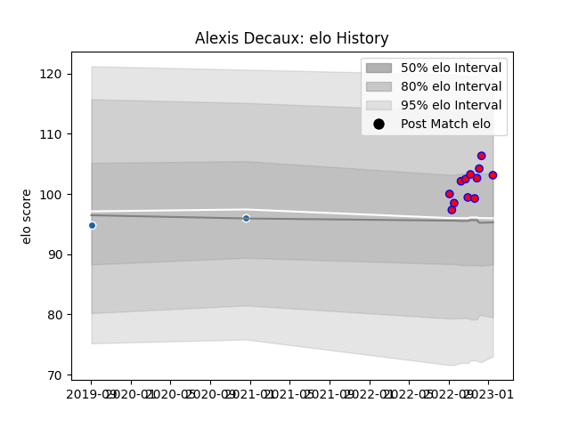

---  
layout: page  
title: Alexis Decaux  
date: 2023-03-17 17:30:18.162260  
categories: player  
---
# Alexis Decaux

## Positions: P

## Current elo: 100.0

## Current Percentile: 74.0

# Elo History

# Match History

| Team              |   Appearances |   Win Rate |
|:------------------|--------------:|-----------:|
| Blagnac           |            16 |    0.78125 |
| Castres Olympique |             2 |    0       |

| Opponent                   |   Matches |   Win Rate |
|:---------------------------|----------:|-----------:|
| Chambery                   |         2 |        1   |
| Rennes                     |         2 |        1   |
| Valence Romans Drome Rugby |         2 |        0.5 |
| Albi                       |         1 |        1   |
| Bourgoin-Jallieu           |         1 |        1   |
| Carqueiranne-Hyères        |         1 |        1   |
| Cognac Saint Jean d'Angély |         1 |        1   |
| Dax                        |         1 |        0   |
| Narbonne                   |         1 |        0.5 |
| Newcastle Falcons          |         1 |        0   |
| Nice                       |         1 |        0   |
| Racing 92                  |         1 |        0   |
| Suresnes                   |         1 |        1   |
| Tarbes                     |         1 |        1   |
| US Bressane                |         1 |        1   |