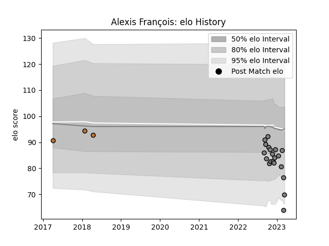

---  
layout: page  
title: Alexis François  
date: 2022-12-09 13:19:11.407786  
categories: player  
---
# Alexis François

## Positions: C

## Current elo: 89.0

## Current Percentile: 25.0

# Elo History

# Match History

| Team     |   Appearances |   Win Rate |
|:---------|--------------:|-----------:|
| Rennes   |            12 |   0.166667 |
| Narbonne |             1 |   0        |

| Opponent                   |   Matches |   Win Rate |
|:---------------------------|----------:|-----------:|
| Albi                       |         1 |          0 |
| Blagnac                    |         1 |          0 |
| Carqueiranne-Hyères        |         1 |          1 |
| Chambery                   |         1 |          0 |
| Cognac Saint Jean d'Angély |         1 |          1 |
| Dax                        |         1 |          0 |
| Montauban                  |         1 |          0 |
| Narbonne                   |         1 |          0 |
| Nice                       |         1 |          0 |
| Suresnes                   |         1 |          0 |
| Tarbes                     |         1 |          0 |
| US Bressane                |         1 |          0 |
| Valence Romans Drome Rugby |         1 |          0 |