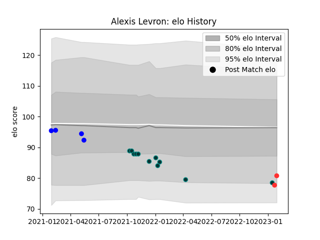

---  
layout: page  
title: Alexis Levron  
date: 2023-01-15 11:42:26.691721  
categories: player  
---
# Alexis Levron

## Positions: SH

## Current elo: 79.0

## Current Percentile: 10.0

# Elo History

# Match History

| Team   |   Appearances |   Win Rate |
|:-------|--------------:|-----------:|
| Pau    |            11 |   0.272727 |
| Vannes |             4 |   0.5      |

| Opponent             |   Matches |   Win Rate |
|:---------------------|----------:|-----------:|
| Brive                |         2 |        0.5 |
| Aurillac             |         1 |        1   |
| Biarritz Olympique   |         1 |        1   |
| Bordeaux Begles      |         1 |        0   |
| Clermont Auvergne    |         1 |        0   |
| Dragons              |         1 |        0   |
| Edinburgh            |         1 |        0   |
| London Irish         |         1 |        0   |
| Lyon                 |         1 |        0   |
| Oyonnax              |         1 |        0   |
| Perpignan            |         1 |        0   |
| Provence Rugby       |         1 |        1   |
| Stade Francais Paris |         1 |        1   |
| Stade Toulousain     |         1 |        0   |