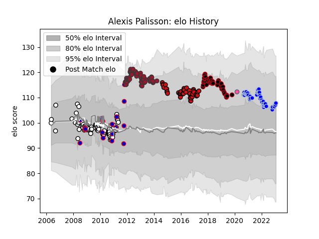

---  
layout: page  
title: Alexis Palisson  
date: 2022-12-18 16:26:45.969424  
categories: player  
---
# Alexis Palisson

## Positions: W, FB

## Country: France

## Current elo: 99.0

## Current Percentile: 66.0

# Elo History

# Match History

| Team                 |   Appearances |   Win Rate |
|:---------------------|--------------:|-----------:|
| Brive                |            77 |   0.435065 |
| Toulon               |            51 |   0.676471 |
| Stade Toulousain     |            45 |   0.477778 |
| Lyon                 |            41 |   0.54878  |
| Colomiers            |            33 |   0.69697  |
| France               |            15 |   0.533333 |
| Stade Francais Paris |             1 |   0        |

| Opponent                   |   Matches |   Win Rate |
|:---------------------------|----------:|-----------:|
| Montpellier Herault        |        19 |   0.631579 |
| Clermont Auvergne          |        17 |   0.411765 |
| Stade Francais Paris       |        14 |   0.75     |
| Stade Toulousain           |        13 |   0.423077 |
| Castres Olympique          |        13 |   0.461538 |
| Bayonne                    |        12 |   0.333333 |
| Toulon                     |        11 |   0.409091 |
| Perpignan                  |        11 |   0.5      |
| Racing 92                  |        11 |   0.5      |
| La Rochelle                |        10 |   0.2      |
| Grenoble                   |         8 |   0.625    |
| Agen                       |         8 |   0.625    |
| Bordeaux Begles            |         7 |   0.642857 |
| Bourgoin-Jallieu           |         6 |   0.666667 |
| Biarritz Olympique         |         6 |   0.333333 |
| Oyonnax                    |         6 |   0.666667 |
| Montauban                  |         6 |   0.333333 |
| Brive                      |         4 |   0.5      |
| Wales                      |         4 |   0.75     |
| Beziers                    |         4 |   0.75     |
| Lyon                       |         4 |   1        |
| Cardiff Blues              |         4 |   0.25     |
| Rouen                      |         4 |   1        |
| Vannes                     |         3 |   0.333333 |
| Albi                       |         3 |   0.666667 |
| Pau                        |         3 |   1        |
| Sale Sharks                |         3 |   0.666667 |
| Australia                  |         3 |   0        |
| Saracens                   |         3 |   0.333333 |
| Glasgow Warriors           |         3 |   0.333333 |
| England                    |         3 |   0.666667 |
| Newcastle Falcons          |         3 |   0.666667 |
| Ulster                     |         2 |   0        |
| Soyaux-Angouleme           |         2 |   1        |
| Nevers                     |         2 |   1        |
| Mont-de-Marsan             |         2 |   1        |
| Exeter Chiefs              |         2 |   1        |
| Dax                        |         2 |   1        |
| Narbonne                   |         1 |   1        |
| Worcester Warriors         |         1 |   0        |
| Argentina                  |         1 |   1        |
| Auch                       |         1 |   1        |
| Valence Romans Drome Rugby |         1 |   0        |
| Aurillac                   |         1 |   1        |
| US Bressane                |         1 |   1        |
| Carcassonne                |         1 |   0        |
| Tonga                      |         1 |   0        |
| Connacht                   |         1 |   1        |
| New Zealand                |         1 |   0        |
| Scarlets                   |         1 |   0        |
| Harlequins                 |         1 |   1        |
| Ireland                    |         1 |   1        |
| Italy                      |         1 |   1        |
| Leicester Tigers           |         1 |   1        |
| Provence Rugby             |         1 |   1        |
| Petrarca Padova            |         1 |   1        |
| Leinster                   |         1 |   0        |
| London Irish               |         1 |   0        |
| Munster                    |         1 |   0        |
| Zebre                      |         1 |   1        |