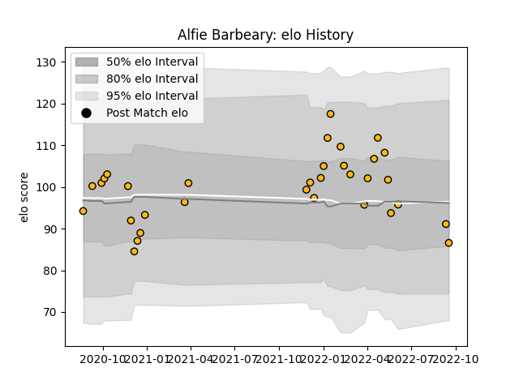

---  
layout: page  
title: Alfie Barbeary  
date: 2023-03-04 11:41:41.147218  
categories: player  
---
# Alfie Barbeary

## Positions: N8, FL

## Current elo: 87.0

## Current Percentile: 37.0

# Elo History

# Match History

| Team   |   Appearances |   Win Rate |
|:-------|--------------:|-----------:|
| Wasps  |            33 |   0.606061 |

| Opponent            |   Matches |   Win Rate |
|:--------------------|----------:|-----------:|
| Gloucester Rugby    |         4 |   0.25     |
| Bristol Rugby       |         4 |   0.5      |
| Sale Sharks         |         4 |   0.25     |
| Leicester Tigers    |         3 |   0.666667 |
| Newcastle Falcons   |         3 |   0.666667 |
| Worcester Warriors  |         3 |   0.666667 |
| Exeter Chiefs       |         2 |   1        |
| Harlequins          |         1 |   1        |
| Biarritz Olympique  |         1 |   1        |
| London Irish        |         1 |   1        |
| Lyon                |         1 |   0        |
| Montpellier Herault |         1 |   1        |
| Munster             |         1 |   0        |
| Edinburgh           |         1 |   1        |
| Dragons             |         1 |   1        |
| Stade Toulousain    |         1 |   1        |
| Bath Rugby          |         1 |   1        |