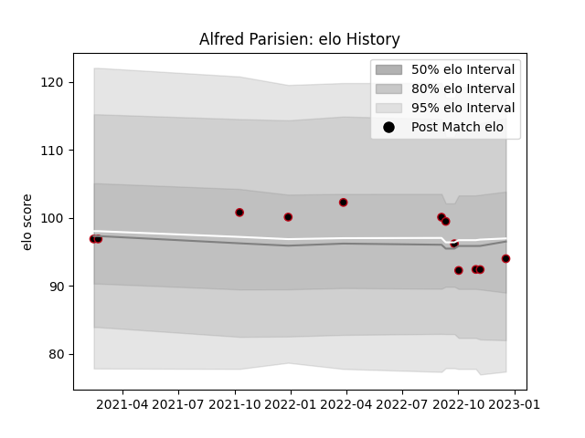

---  
layout: page  
title: Alfred Parisien  
date: 2022-12-18 16:21:55.533140  
categories: player  
---
# Alfred Parisien

## Positions: C, W

## Current elo: 94.0

## Current Percentile: 36.0

# Elo History

# Match History

| Team   |   Appearances |   Win Rate |
|:-------|--------------:|-----------:|
| Lyon   |            12 |   0.416667 |

| Opponent             |   Matches |   Win Rate |
|:---------------------|----------:|-----------:|
| La Rochelle          |         2 |        0   |
| Stade Toulousain     |         2 |        0.5 |
| Biarritz Olympique   |         1 |        1   |
| Brive                |         1 |        1   |
| Castres Olympique    |         1 |        1   |
| Clermont Auvergne    |         1 |        0   |
| Perpignan            |         1 |        0   |
| Racing 92            |         1 |        0   |
| Saracens             |         1 |        0   |
| Stade Francais Paris |         1 |        1   |