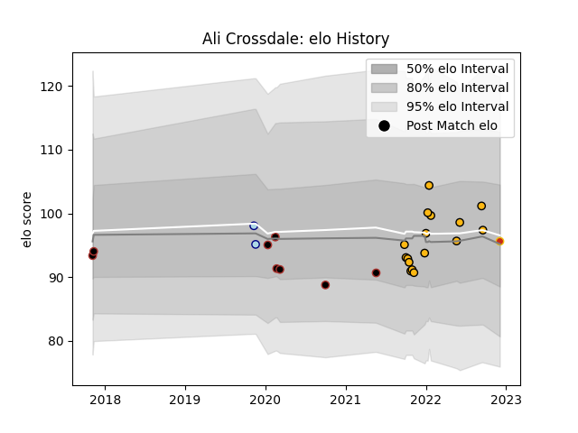

---  
layout: page  
title: Ali Crossdale  
date: 2022-12-09 13:05:04.497374  
categories: player  
---
# Ali Crossdale

## Positions: FB, W

## Current elo: 96.0

## Current Percentile: 56.0

# Elo History

# Match History

| Team      |   Appearances |   Win Rate |
|:----------|--------------:|-----------:|
| Wasps     |            16 |      0.375 |
| Saracens  |             8 |      0.5   |
| Bedford   |             2 |      0     |
| Perpignan |             1 |      0     |

| Opponent           |   Matches |   Win Rate |
|:-------------------|----------:|-----------:|
| Sale Sharks        |         4 |   0.25     |
| Leicester Tigers   |         3 |   0.666667 |
| Newcastle Falcons  |         2 |   0        |
| Bristol Rugby      |         2 |   0.5      |
| Stade Toulousain   |         2 |   0.5      |
| Harlequins         |         2 |   0        |
| Nottingham         |         1 |   0        |
| Wasps              |         1 |   0        |
| Saracens           |         1 |   0        |
| Ospreys            |         1 |   1        |
| Ampthill           |         1 |   1        |
| Northampton Saints |         1 |   1        |
| Bath Rugby         |         1 |   1        |
| Munster            |         1 |   0        |
| London Irish       |         1 |   1        |
| Gloucester Rugby   |         1 |   0        |
| Exeter Chiefs      |         1 |   0        |
| Worcester Warriors |         1 |   0        |