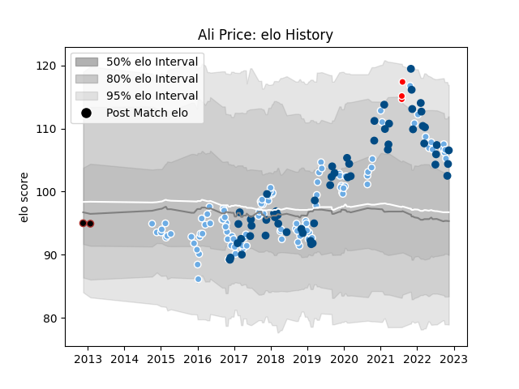

---  
layout: page  
title: Ali Price  
date: 2023-03-21 18:46:15.947269  
categories: player  
---
# Ali Price

Last updated: 2023-03-21
## Positions: SH

## Country: Scotland

## Current elo: 84.0

## Current Percentile: 27.0

# Elo History

# Match History

| Team                    |   Appearances |   Win Rate |
|:------------------------|--------------:|-----------:|
| Glasgow Warriors        |           118 |   0.516949 |
| Scotland                |            62 |   0.540323 |
| British and Irish Lions |             4 |   0.5      |
| Saracens                |             2 |   0.5      |

| Opponent            |   Matches |   Win Rate |
|:--------------------|----------:|-----------:|
| Edinburgh           |        18 |   0.333333 |
| Leinster            |        10 |   0.3      |
| Cardiff Blues       |        10 |   0.8      |
| Ireland             |         8 |   0.125    |
| France              |         8 |   0.375    |
| Italy               |         8 |   1        |
| Wales               |         7 |   0.285714 |
| Munster             |         7 |   0.428571 |
| Exeter Chiefs       |         7 |   0.357143 |
| Ospreys             |         6 |   0.75     |
| Connacht            |         6 |   0.666667 |
| England             |         6 |   0.583333 |
| Ulster              |         5 |   0.4      |
| South Africa        |         5 |   0.2      |
| Scarlets            |         5 |   0.4      |
| Australia           |         5 |   0.6      |
| Argentina           |         5 |   0.6      |
| Zebre               |         5 |   1        |
| Benetton Treviso    |         5 |   0.8      |
| Saracens            |         4 |   0        |
| Georgia             |         4 |   1        |
| Racing 92           |         4 |   0.75     |
| La Rochelle         |         4 |   0.25     |
| Sale Sharks         |         3 |   0.666667 |
| Montpellier Herault |         3 |   0        |
| Dragons             |         3 |   1        |
| Lyon                |         3 |   0.666667 |
| Bulls               |         2 |   0.5      |
| Cheetahs            |         2 |   1        |
| Leicester Tigers    |         2 |   1        |
| Fiji                |         2 |   0.5      |
| Japan               |         2 |   1        |
| New Zealand         |         2 |   0        |
| Perpignan           |         1 |   1        |
| Chile               |         1 |   1        |
| Northampton Saints  |         1 |   0        |
| Sharks              |         1 |   0        |
| Canada              |         1 |   1        |
| Southern Kings      |         1 |   0        |
| Stormers            |         1 |   0        |
| Tonga               |         1 |   1        |
| Newcastle Falcons   |         1 |   1        |
| Samoa               |         1 |   1        |