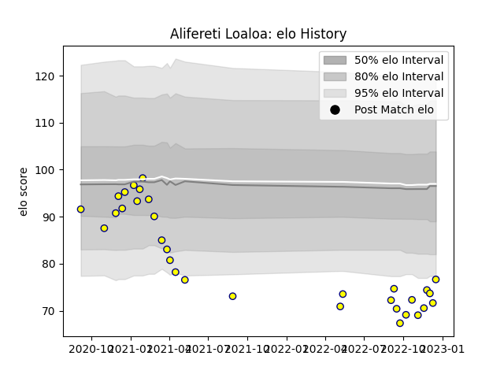

---  
layout: page  
title: Alifereti Loaloa  
date: 2023-02-02 18:55:22.195983  
categories: player  
---
# Alifereti Loaloa

## Positions: C

## Current elo: 79.0

## Current Percentile: 7.0

# Elo History

# Match History

| Team   |   Appearances |   Win Rate |
|:-------|--------------:|-----------:|
| Nevers |            41 |        0.5 |

| Opponent                   |   Matches |   Win Rate |
|:---------------------------|----------:|-----------:|
| Vannes                     |         4 |   0.5      |
| Oyonnax                    |         4 |   0        |
| Rouen                      |         4 |   0.75     |
| Provence Rugby             |         4 |   0.75     |
| Soyaux-Angouleme           |         3 |   1        |
| Mont-de-Marsan             |         3 |   0.666667 |
| Biarritz Olympique         |         3 |   0.5      |
| Grenoble                   |         2 |   0        |
| Montauban                  |         2 |   1        |
| Colomiers                  |         2 |   0        |
| Carcassonne                |         2 |   0        |
| Beziers                    |         2 |   1        |
| Agen                       |         2 |   0.5      |
| Massy                      |         1 |   1        |
| Aurillac                   |         1 |   0        |
| Perpignan                  |         1 |   0        |
| Valence Romans Drome Rugby |         1 |   0        |