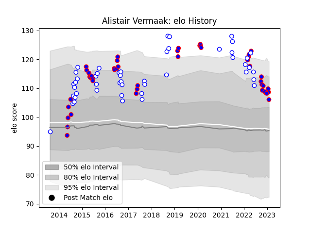

---  
layout: page  
title: Alistair Vermaak  
date: 2023-02-02 19:00:48.518237  
categories: player  
---
# Alistair Vermaak

## Positions: P

## Current elo: 106.0

## Current Percentile: 84.0

# Elo History

# Match History

| Team             |   Appearances |   Win Rate |
|:-----------------|--------------:|-----------:|
| Stormers         |            47 |   0.691489 |
| Western Province |            47 |   0.606383 |

| Opponent               |   Matches |   Win Rate |
|:-----------------------|----------:|-----------:|
| Blue Bulls             |         9 |   0.611111 |
| Free State Cheetahs    |         8 |   0.5      |
| Golden Lions           |         8 |   0.375    |
| Pumas                  |         7 |   0.714286 |
| Sharks                 |         6 |   0.5      |
| Griquas                |         6 |   0.5      |
| Bulls                  |         6 |   0.5      |
| Natal Sharks           |         5 |   0.8      |
| Cheetahs               |         4 |   0.75     |
| Western Force          |         3 |   1        |
| Lions                  |         3 |   1        |
| Eastern Province Kings |         3 |   1        |
| Melbourne Rebels       |         2 |   1        |
| Chiefs                 |         2 |   0        |
| Clermont Auvergne      |         2 |   0.5      |
| Brumbies               |         2 |   0.5      |
| Ospreys                |         2 |   0.75     |
| Connacht               |         2 |   0.5      |
| Zebre                  |         2 |   1        |
| Hurricanes             |         2 |   0.5      |
| London Irish           |         1 |   1        |
| Cardiff Blues          |         1 |   1        |
| Jaguares               |         1 |   1        |
| Blues                  |         1 |   1        |
| Scarlets               |         1 |   1        |
| Boland Cavaliers       |         1 |   1        |
| Southern Kings         |         1 |   1        |
| Ulster                 |         1 |   0        |
| Glasgow Warriors       |         1 |   1        |
| Edinburgh              |         1 |   1        |