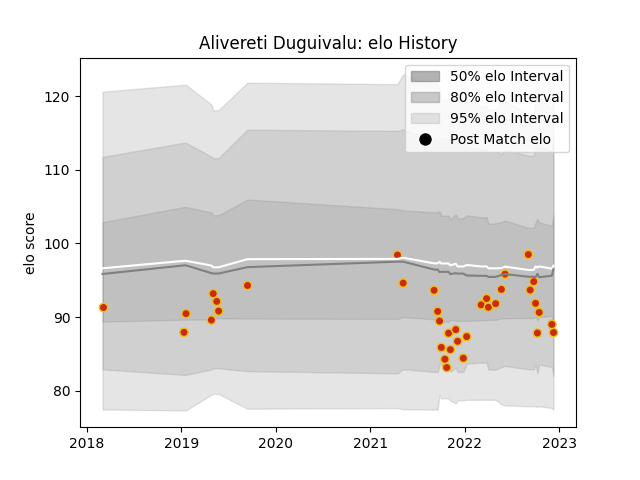

---  
layout: page  
title: Alivereti Duguivalu  
date: 2022-12-18 16:12:32.840730  
categories: player  
---
# Alivereti Duguivalu

## Positions: W, C

## Current elo: 88.0

## Current Percentile: 21.0

# Elo History

# Match History

| Team      |   Appearances |   Win Rate |
|:----------|--------------:|-----------:|
| Perpignan |            36 |   0.277778 |

| Opponent             |   Matches |   Win Rate |
|:---------------------|----------:|-----------:|
| Bordeaux Begles      |         3 |   0.333333 |
| Stade Toulousain     |         3 |   0        |
| Brive                |         3 |   0.333333 |
| Castres Olympique    |         3 |   0.333333 |
| Clermont Auvergne    |         3 |   0.333333 |
| Pau                  |         3 |   0        |
| Toulon               |         2 |   1        |
| Racing 92            |         2 |   0.5      |
| Stade Francais Paris |         2 |   0        |
| La Rochelle          |         2 |   0.5      |
| Montpellier Herault  |         2 |   0        |
| Sale Sharks          |         1 |   0        |
| Rouen                |         1 |   0        |
| Beziers              |         1 |   1        |
| Nevers               |         1 |   0        |
| Biarritz Olympique   |         1 |   1        |
| Carcassonne          |         1 |   0        |
| Bristol Rugby        |         1 |   0        |
| Lyon                 |         1 |   0        |