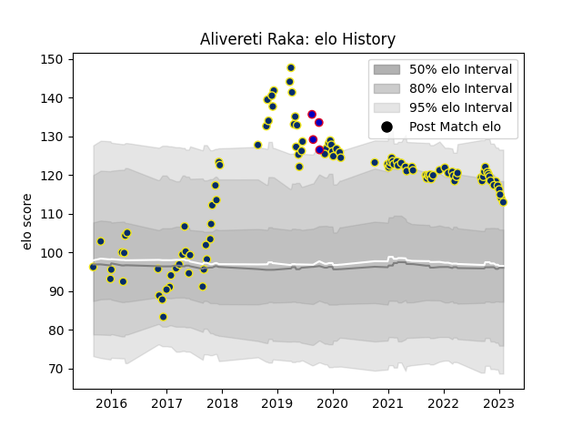

---  
layout: page  
title: Alivereti Raka  
date: 2022-12-18 16:15:24.662884  
categories: player  
---
# Alivereti Raka

## Positions: W

## Country: France

## Current elo: 110.0

## Current Percentile: 84.0

# Elo History

# Match History

| Team              |   Appearances |   Win Rate |
|:------------------|--------------:|-----------:|
| Clermont Auvergne |           105 |   0.638095 |
| France            |             4 |   0.75     |

| Opponent                 |   Matches |   Win Rate |
|:-------------------------|----------:|-----------:|
| Racing 92                |        10 |   0.35     |
| Bordeaux Begles          |         9 |   0.388889 |
| Lyon                     |         9 |   0.777778 |
| Toulon                   |         8 |   0.375    |
| Agen                     |         6 |   1        |
| Stade Francais Paris     |         6 |   0.666667 |
| Castres Olympique        |         6 |   0.5      |
| Pau                      |         6 |   0.666667 |
| La Rochelle              |         5 |   1        |
| Stade Toulousain         |         5 |   0.2      |
| Montpellier Herault      |         4 |   0.25     |
| Brive                    |         4 |   1        |
| Grenoble                 |         3 |   0.833333 |
| Perpignan                |         3 |   1        |
| Ulster                   |         3 |   0.333333 |
| Harlequins               |         2 |   1        |
| Timisoara Saracens       |         2 |   1        |
| Northampton Saints       |         2 |   1        |
| Bath Rugby               |         2 |   1        |
| Oyonnax                  |         2 |   0.75     |
| Saracens                 |         2 |   1        |
| Scotland                 |         2 |   0.5      |
| Bayonne                  |         2 |   0        |
| Tonga                    |         1 |   1        |
| Ospreys                  |         1 |   1        |
| Stormers                 |         1 |   1        |
| Exeter Chiefs            |         1 |   1        |
| Biarritz Olympique       |         1 |   1        |
| United States of America |         1 |   1        |