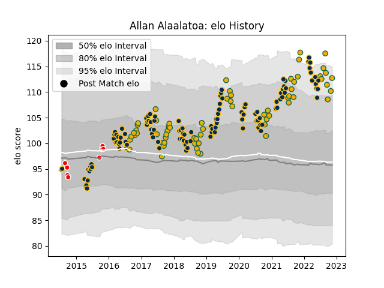

---  
layout: page  
title: Allan Alaalatoa  
date: 2023-02-24 09:46:34.972520  
categories: player  
---
# Allan Alaalatoa

## Positions: P

## Country: Australia

## Current elo: 133.0

## Current Percentile: 99.0

# Elo History

# Match History

| Team             |   Appearances |   Win Rate |
|:-----------------|--------------:|-----------:|
| Brumbies         |           114 |   0.561404 |
| Australia        |            66 |   0.439394 |
| Canberra Vikings |            19 |   0.578947 |

| Opponent                 |   Matches |   Win Rate |
|:-------------------------|----------:|-----------:|
| New Zealand              |        22 |   0.159091 |
| Melbourne Rebels         |        14 |   0.5      |
| Queensland Reds          |        14 |   0.571429 |
| New South Wales Waratahs |        13 |   0.769231 |
| Argentina                |         9 |   0.722222 |
| Western Force            |         9 |   1        |
| South Africa             |         8 |   0.625    |
| Highlanders              |         7 |   0.142857 |
| Crusaders                |         7 |   0        |
| Hurricanes               |         7 |   0.428571 |
| Chiefs                   |         7 |   0.571429 |
| Sunwolves                |         6 |   1        |
| Blues                    |         6 |   0.166667 |
| Wales                    |         5 |   0.4      |
| England                  |         5 |   0.2      |
| Jaguares                 |         4 |   0.25     |
| Stormers                 |         4 |   0.5      |
| Lions                    |         4 |   0.5      |
| Scotland                 |         4 |   0.5      |
| Bulls                    |         4 |   1        |
| France                   |         4 |   0.75     |
| NSW Country Eagles       |         3 |   0.333333 |
| Melbourne Rising         |         3 |   0.666667 |
| Sharks                   |         3 |   0.666667 |
| Brisbane City            |         3 |   0        |
| Queensland Country       |         2 |   1        |
| Sydney Stars             |         2 |   0.75     |
| Greater Sydney Rams      |         2 |   1        |
| Perth Spirit             |         2 |   0.5      |
| Cheetahs                 |         2 |   1        |
| Fiji                     |         2 |   1        |
| Japan                    |         2 |   1        |
| Italy                    |         2 |   0.5      |
| Ireland                  |         2 |   0        |
| North Harbour Rays       |         2 |   0.75     |
| Moana Pasifika           |         1 |   0        |
| Southern Kings           |         1 |   1        |
| Uruguay                  |         1 |   1        |
| Fijian Drua              |         1 |   1        |