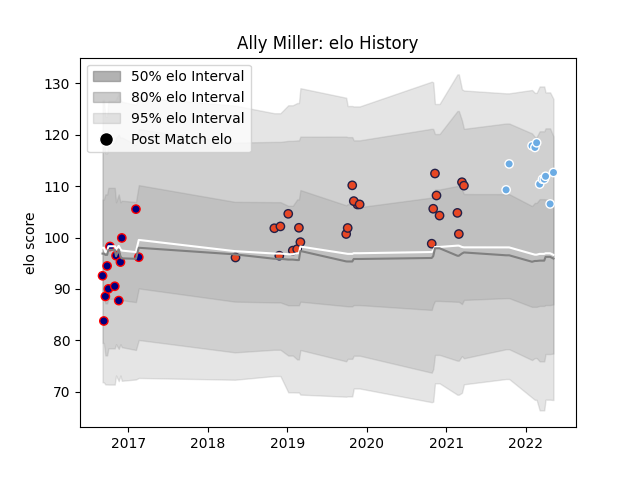

---  
layout: page  
title: Ally Miller  
date: 2023-02-28 11:02:35.360683  
categories: player  
---
# Ally Miller

## Positions: FL, N8

## Current elo: 113.0

## Current Percentile: 75.0

# Elo History

# Match History

| Team             |   Appearances |   Win Rate |
|:-----------------|--------------:|-----------:|
| Edinburgh        |            24 |   0.458333 |
| London Scottish  |            13 |   0.384615 |
| Glasgow Warriors |            11 |   0.636364 |

| Opponent            |   Matches |   Win Rate |
|:--------------------|----------:|-----------:|
| Cardiff Blues       |         5 |   0.4      |
| Scarlets            |         5 |   0.6      |
| Munster             |         5 |   0.4      |
| Zebre               |         3 |   1        |
| Benetton Treviso    |         3 |   0.333333 |
| Connacht            |         3 |   0.666667 |
| Cornish Pirates     |         2 |   0.5      |
| Dragons             |         2 |   0.5      |
| Jersey              |         2 |   0.5      |
| Southern Kings      |         2 |   0.5      |
| Richmond            |         1 |   0        |
| Yorkshire Carnegie  |         1 |   0        |
| Ulster              |         1 |   0        |
| Stormers            |         1 |   0        |
| Sharks              |         1 |   1        |
| Rotherham Titans    |         1 |   1        |
| Agen                |         1 |   1        |
| Nottingham          |         1 |   0        |
| Lyon                |         1 |   0        |
| Bedford             |         1 |   1        |
| London Irish        |         1 |   0        |
| Leinster            |         1 |   0        |
| Edinburgh           |         1 |   1        |
| Ealing Trailfinders |         1 |   1        |
| Doncaster           |         1 |   0        |
| London Welsh        |         1 |   0        |