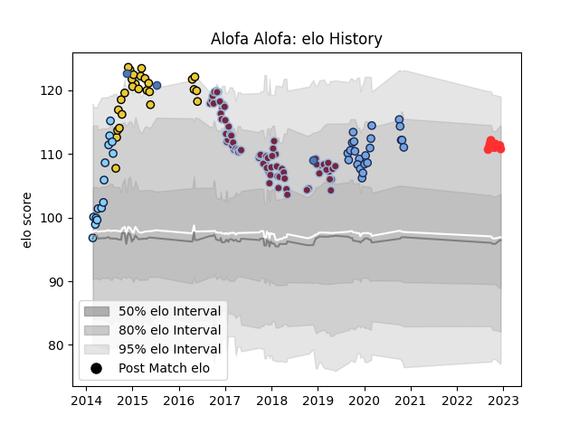

---  
layout: page  
title: Alofa Alofa  
date: 2023-02-02 18:43:32.794800  
categories: player  
---
# Alofa Alofa

## Positions: W, C

## Country: Samoa

## Current elo: 144.0

## Current Percentile: 98.0

# Elo History

# Match History

| Team                     |   Appearances |   Win Rate |
|:-------------------------|--------------:|-----------:|
| Harlequins               |            71 |   0.394366 |
| La Rochelle              |            27 |   0.462963 |
| Bayonne                  |            23 |   0.456522 |
| New South Wales Waratahs |            15 |   0.866667 |
| Tarbes                   |            13 |   0.5      |
| Samoa                    |             6 |   0.666667 |

| Opponent                   |   Matches |   Win Rate |
|:---------------------------|----------:|-----------:|
| Worcester Warriors         |         8 |   0.75     |
| Exeter Chiefs              |         8 |   0.125    |
| Saracens                   |         7 |   0.428571 |
| Northampton Saints         |         6 |   0.333333 |
| Wasps                      |         5 |   0.4      |
| Sale Sharks                |         5 |   0.4      |
| Montpellier Herault        |         5 |   0.7      |
| Leicester Tigers           |         5 |   0        |
| Stade Toulousain           |         4 |   0.5      |
| Stade Francais Paris       |         4 |   0.625    |
| Newcastle Falcons          |         4 |   0.25     |
| Bath Rugby                 |         4 |   0.5      |
| Grenoble                   |         4 |   0.5      |
| Gloucester Rugby           |         4 |   0.5      |
| Agen                       |         4 |   0.75     |
| Bordeaux Begles            |         4 |   0.25     |
| Castres Olympique          |         4 |   0.5      |
| Clermont Auvergne          |         3 |   0        |
| London Irish               |         3 |   0.333333 |
| Brumbies                   |         3 |   0.666667 |
| La Rochelle                |         3 |   0.333333 |
| Racing 92                  |         3 |   0.5      |
| Toulon                     |         3 |   0.333333 |
| Lyon                       |         3 |   0.5      |
| Blagnac                    |         2 |   0.25     |
| Rennes                     |         2 |   1        |
| Melbourne Rebels           |         2 |   1        |
| Timisoara Saracens         |         2 |   1        |
| Queensland Reds            |         2 |   1        |
| Oyonnax                    |         2 |   0.5      |
| Bristol Rugby              |         2 |   1        |
| Ulster                     |         2 |   0        |
| Bayonne                    |         2 |   0.25     |
| Brive                      |         2 |   0.75     |
| Edinburgh                  |         2 |   0        |
| Chambery                   |         2 |   0.5      |
| Germany                    |         2 |   1        |
| Canada                     |         1 |   1        |
| Sharks                     |         1 |   0        |
| Western Force              |         1 |   1        |
| Connacht                   |         1 |   0        |
| Crusaders                  |         1 |   1        |
| US Bressane                |         1 |   0        |
| Dax                        |         1 |   0        |
| Stormers                   |         1 |   1        |
| Benetton Treviso           |         1 |   1        |
| Chiefs                     |         1 |   1        |
| Spain                      |         1 |   1        |
| Scarlets                   |         1 |   0        |
| Narbonne                   |         1 |   1        |
| Georgia                    |         1 |   0        |
| Bourgoin-Jallieu           |         1 |   1        |
| Highlanders                |         1 |   1        |
| Pau                        |         1 |   0        |
| Hurricanes                 |         1 |   1        |
| Carqueiranne-Hyères        |         1 |   0        |
| Nice                       |         1 |   0        |
| Cognac Saint Jean d'Angély |         1 |   1        |
| New Zealand                |         1 |   0        |
| Lions                      |         1 |   1        |