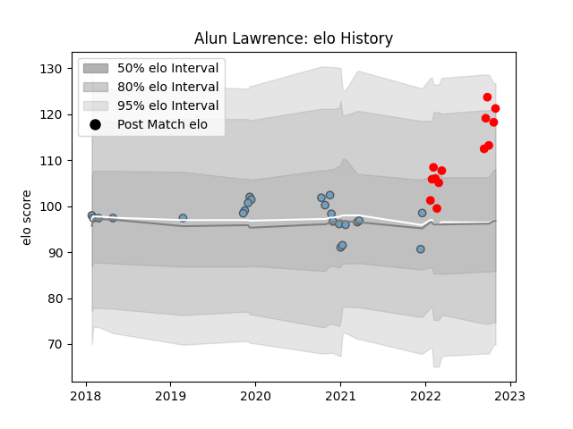

---  
layout: page  
title: Alun Lawrence  
date: 2023-03-21 17:57:32.291460  
categories: player  
---
# Alun Lawrence

Last updated: 2023-03-21
## Positions: N8, FL

## Current elo: 121.0

## Current Percentile: 87.0

# Elo History

# Match History

| Team          |   Appearances |   Win Rate |
|:--------------|--------------:|-----------:|
| Cardiff Blues |            23 |   0.565217 |
| Jersey        |            13 |   0.846154 |

| Opponent            |   Matches |   Win Rate |
|:--------------------|----------:|-----------:|
| Benetton Treviso    |         3 |        1   |
| Ampthill            |         2 |        1   |
| Edinburgh           |         2 |        1   |
| Scarlets            |         2 |        1   |
| Pau                 |         2 |        0.5 |
| Ospreys             |         2 |        0   |
| Nottingham          |         2 |        1   |
| Hartpury College    |         2 |        1   |
| Cornish Pirates     |         2 |        0.5 |
| Dragons             |         1 |        1   |
| Ealing Trailfinders |         1 |        0   |
| Stade Toulousain    |         1 |        0   |
| Calvisano           |         1 |        1   |
| Richmond            |         1 |        1   |
| Cheetahs            |         1 |        1   |
| Connacht            |         1 |        1   |
| Munster             |         1 |        0   |
| London Scottish     |         1 |        1   |
| London Irish        |         1 |        0   |
| Leinster            |         1 |        0   |
| Leicester Tigers    |         1 |        0   |
| Coventry            |         1 |        1   |
| Harlequins          |         1 |        0   |
| Glasgow Warriors    |         1 |        0   |
| Doncaster           |         1 |        1   |
| Zebre               |         1 |        1   |