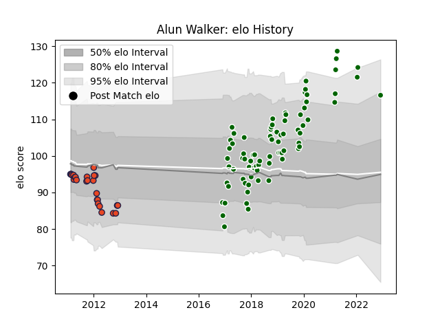

---  
layout: page  
title: Alun Walker  
date: 2022-12-12 15:09:34.972545  
categories: player  
---
# Alun Walker

## Positions: H

## Current elo: 118.0

## Current Percentile: 98.0

# Elo History

# Match History

| Team                |   Appearances |   Win Rate |
|:--------------------|--------------:|-----------:|
| Ealing Trailfinders |            61 |   0.819672 |
| Edinburgh           |            27 |   0.314815 |

| Opponent           |   Matches |   Win Rate |
|:-------------------|----------:|-----------:|
| Jersey             |         7 |   1        |
| Cornish Pirates    |         7 |   0.714286 |
| London Scottish    |         7 |   0.857143 |
| Nottingham         |         6 |   0.833333 |
| Coventry           |         5 |   1        |
| Dragons            |         5 |   0.2      |
| Hartpury College   |         5 |   1        |
| Bedford            |         4 |   0.75     |
| Richmond           |         4 |   1        |
| Doncaster          |         4 |   1        |
| London Irish       |         3 |   0.333333 |
| Ulster             |         3 |   0        |
| Rotherham Titans   |         3 |   1        |
| Ospreys            |         3 |   0.666667 |
| Yorkshire Carnegie |         3 |   0.666667 |
| Connacht           |         3 |   0.333333 |
| Munster            |         2 |   0.5      |
| Glasgow Warriors   |         2 |   0.25     |
| Cardiff Blues      |         2 |   0        |
| Bristol Rugby      |         2 |   0        |
| Scarlets           |         2 |   0        |
| Aironi             |         2 |   0.5      |
| Ampthill           |         1 |   1        |
| Newcastle Falcons  |         1 |   0        |
| Racing 92          |         1 |   1        |
| Benetton Treviso   |         1 |   0        |