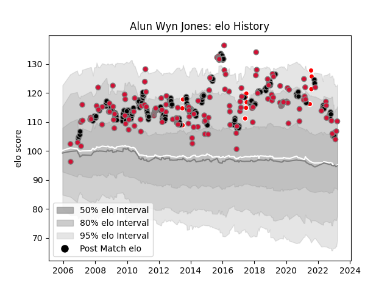

---  
layout: page  
title: Alun Wyn Jones  
date: 2023-03-16 21:11:30.309229  
categories: player  
---
# Alun Wyn Jones

## Positions: L

## Country: Wales

## Current elo: 107.0

## Current Percentile: 73.0

# Elo History

# Match History

| Team                    |   Appearances |   Win Rate |
|:------------------------|--------------:|-----------:|
| Ospreys                 |           215 |   0.64186  |
| Wales                   |           148 |   0.469595 |
| British and Irish Lions |            14 |   0.607143 |
| Neath  Swansea          |             1 |   0        |

| Opponent                 |   Matches |   Win Rate |
|:-------------------------|----------:|-----------:|
| South Africa             |        23 |   0.26087  |
| Scarlets                 |        21 |   0.761905 |
| England                  |        20 |   0.45     |
| Australia                |        20 |   0.25     |
| Cardiff Blues            |        20 |   0.825    |
| Dragons                  |        17 |   0.794118 |
| Ireland                  |        16 |   0.53125  |
| France                   |        16 |   0.4375   |
| Munster                  |        16 |   0.40625  |
| New Zealand              |        16 |   0.09375  |
| Leinster                 |        15 |   0.4      |
| Scotland                 |        14 |   0.785714 |
| Italy                    |        12 |   0.833333 |
| Benetton Treviso         |        12 |   0.833333 |
| Ulster                   |        12 |   0.5      |
| Glasgow Warriors         |        10 |   0.6      |
| Edinburgh                |         9 |   0.888889 |
| Leicester Tigers         |         8 |   0.4375   |
| Connacht                 |         8 |   0.875    |
| Zebre                    |         7 |   0.857143 |
| Northampton Saints       |         6 |   0.333333 |
| Clermont Auvergne        |         6 |   0.333333 |
| Argentina                |         6 |   0.5      |
| Fiji                     |         5 |   0.8      |
| Aironi                   |         4 |   1        |
| Saracens                 |         4 |   0.125    |
| Japan                    |         3 |   1        |
| London Irish             |         3 |   0.333333 |
| Biarritz Olympique       |         2 |   0.5      |
| Perpignan                |         2 |   0.5      |
| Samoa                    |         2 |   1        |
| Newcastle Falcons        |         2 |   0.5      |
| Calvisano                |         2 |   1        |
| Bourgoin-Jallieu         |         2 |   1        |
| Bordeaux Begles          |         2 |   0.5      |
| Casa Montepaschi Viadana |         2 |   1        |
| Racing 92                |         2 |   0.25     |
| Toulon                   |         2 |   0.5      |
| Gloucester Rugby         |         2 |   0.5      |
| Cheetahs                 |         2 |   0.5      |
| Arix Viadana             |         2 |   1        |
| Exeter Chiefs            |         2 |   0.5      |
| Sharks                   |         1 |   0        |
| Stade Francais Paris     |         1 |   0.5      |
| Stormers                 |         1 |   0.5      |
| Tonga                    |         1 |   1        |
| Worcester Warriors       |         1 |   1        |
| Sale Sharks              |         1 |   1        |
| Crusaders                |         1 |   1        |
| Provincial Union XV      |         1 |   1        |
| Pacific Islands          |         1 |   1        |
| Bulls                    |         1 |   0        |
| Montpellier Herault      |         1 |   1        |
| Lyon                     |         1 |   1        |
| Lions                    |         1 |   0        |
| Canada                   |         1 |   1        |
| Castres Olympique        |         1 |   0        |
| Highlanders              |         1 |   0        |
| Harlequins               |         1 |   1        |
| Grenoble                 |         1 |   1        |
| Georgia                  |         1 |   1        |
| Chiefs                   |         1 |   1        |
| Namibia                  |         1 |   1        |