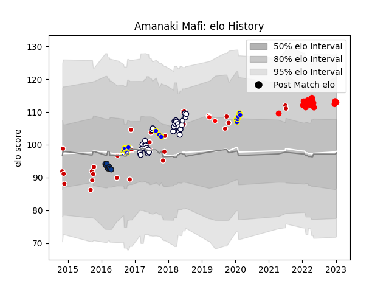

---  
layout: page  
title: Amanaki Mafi  
date: 2023-02-02 19:11:10.027013  
categories: player  
---
# Amanaki Mafi

## Positions: N8

## Country: Japan

## Current elo: 115.0

## Current Percentile: 85.0

# Elo History

# Match History

| Team                  |   Appearances |   Win Rate |
|:----------------------|--------------:|-----------:|
| Melbourne Rebels      |            31 |   0.274194 |
| Japan                 |            29 |   0.396552 |
| Yokohama Canon Eagles |            20 |   0.575    |
| Urayasu D-Rocks       |            16 |   0.5625   |
| Bath Rugby            |             7 |   0.285714 |
| Sunwolves             |             3 |   0        |

| Opponent                          |   Matches |   Win Rate |
|:----------------------------------|----------:|-----------:|
| Green Rockets Tokatsu             |         5 |   1        |
| Black Rams Tokyo                  |         4 |   0.75     |
| Saitama Wild Knights              |         4 |   0        |
| Brumbies                          |         4 |   0.75     |
| Queensland Reds                   |         4 |   0.25     |
| New South Wales Waratahs          |         4 |   0        |
| Ireland                           |         4 |   0.25     |
| Kubota Spears Funabashi Tokyo-Bay |         4 |   0.375    |
| Georgia                           |         4 |   0.75     |
| Kobelco Kobe Steelers             |         4 |   0.5      |
| South Africa                      |         3 |   0.333333 |
| Shizuoka Blue Revs                |         3 |   0.333333 |
| Scotland                          |         3 |   0        |
| Tokyo Sungoliath                  |         3 |   0        |
| Jaguares                          |         2 |   0        |
| Highlanders                       |         2 |   0        |
| Lions                             |         2 |   0        |
| New Zealand Maori                 |         2 |   0        |
| Romania                           |         2 |   1        |
| Italy                             |         2 |   0.5      |
| Sharks                            |         2 |   0.75     |
| Hurricanes                        |         2 |   0        |
| Sunwolves                         |         2 |   1        |
| Hanazono Kintetsu Liners          |         2 |   1        |
| Crusaders                         |         2 |   0        |
| Blues                             |         2 |   0.5      |
| Tonga                             |         1 |   1        |
| Toshiba Brave Lupus Tokyo         |         1 |   0        |
| Toyota Industries Shuttles Aichi  |         1 |   1        |
| Stormers                          |         1 |   0        |
| Southern Kings                    |         1 |   0        |
| United States of America          |         1 |   1        |
| Urayasu D-Rocks                   |         1 |   1        |
| Wales                             |         1 |   0        |
| Wasps                             |         1 |   0        |
| Western Force                     |         1 |   0        |
| Argentina                         |         1 |   0        |
| Melbourne Rebels                  |         1 |   0        |
| Saracens                          |         1 |   0        |
| France                            |         1 |   0.5      |
| British and Irish Lions           |         1 |   0        |
| Bulls                             |         1 |   0        |
| Chiefs                            |         1 |   0        |
| Coca-Cola Red Sparks              |         1 |   1        |
| Exeter Chiefs                     |         1 |   0        |
| Fiji                              |         1 |   0        |
| Gloucester Rugby                  |         1 |   1        |
| Samoa                             |         1 |   1        |
| Harlequins                        |         1 |   0        |
| Hino Red Dolphins                 |         1 |   1        |
| Australia                         |         1 |   0        |
| Mie Honda Heat                    |         1 |   1        |
| Munakata Sanix Blues              |         1 |   1        |
| Sale Sharks                       |         1 |   0        |
| Worcester Warriors                |         1 |   1        |