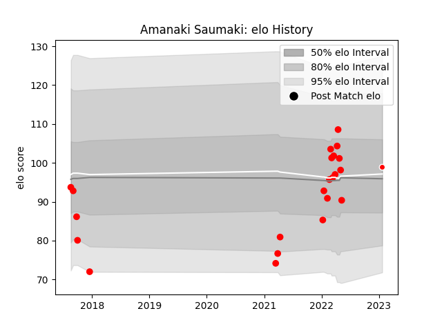

---  
layout: page  
title: Amanaki Saumaki  
date: 2023-02-02 18:59:50.361537  
categories: player  
---
# Amanaki Saumaki

## Positions: L, W

## Current elo: 89.0

## Current Percentile: 59.0

# Elo History

# Match History

| Team                  |   Appearances |   Win Rate |
|:----------------------|--------------:|-----------:|
| Yokohama Canon Eagles |            22 |   0.590909 |
| Kobelco Kobe Steelers |             2 |   0        |

| Opponent                          |   Matches |   Win Rate |
|:----------------------------------|----------:|-----------:|
| Green Rockets Tokatsu             |         4 |   0.75     |
| Kubota Spears Funabashi Tokyo-Bay |         3 |   0.333333 |
| Shizuoka Blue Revs                |         3 |   0.666667 |
| Toyota Verblitz                   |         3 |   0.333333 |
| Black Rams Tokyo                  |         2 |   1        |
| Kobelco Kobe Steelers             |         2 |   0.5      |
| Tokyo Sungoliath                  |         2 |   0        |
| Coca-Cola Red Sparks              |         1 |   1        |
| NTT Docomo Red Hurricanes Osaka   |         1 |   1        |
| Saitama Wild Knights              |         1 |   0        |
| Toshiba Brave Lupus Tokyo         |         1 |   0        |
| Urayasu D-Rocks                   |         1 |   1        |