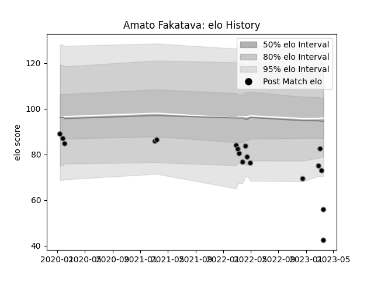

---  
layout: page  
title: Amato Fakatava  
date: 2022-12-18 16:38:20.489878  
categories: player  
---
# Amato Fakatava

## Positions: N8, W

## Current elo: 82.0

## Current Percentile: 15.0

# Elo History

# Match History

| Team             |   Appearances |   Win Rate |
|:-----------------|--------------:|-----------:|
| Black Rams Tokyo |             6 |          0 |

| Opponent                        |   Matches |   Win Rate |
|:--------------------------------|----------:|-----------:|
| Mie Honda Heat                  |         1 |          0 |
| Mitsubishi Dynaboars            |         1 |          0 |
| NTT Docomo Red Hurricanes Osaka |         1 |          0 |
| Shizuoka Blue Revs              |         1 |          0 |
| Toshiba Brave Lupus Tokyo       |         1 |          0 |
| Urayasu D-Rocks                 |         1 |          0 |