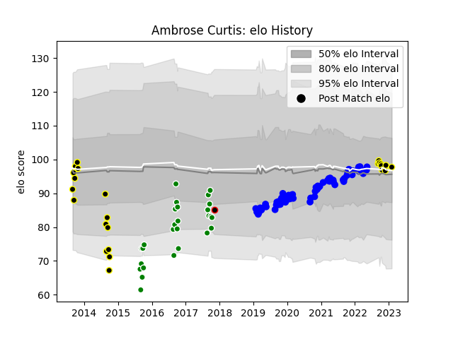

---  
layout: page  
title: Ambrose Curtis  
date: 2022-12-12 15:34:26.381639  
categories: player  
---
# Ambrose Curtis

## Positions: W, C

## Country: New Zealand Maori

## Current elo: 93.0

## Current Percentile: 30.0

# Elo History

# Match History

| Team              |   Appearances |   Win Rate |
|:------------------|--------------:|-----------:|
| Vannes            |            51 |   0.607843 |
| Manawatu          |            27 |   0.407407 |
| Wellington        |            14 |   0.428571 |
| Mont-de-Marsan    |             8 |   0.625    |
| New Zealand Maori |             1 |   1        |

| Opponent                   |   Matches |   Win Rate |
|:---------------------------|----------:|-----------:|
| Montauban                  |         7 |   0.571429 |
| Northland                  |         5 |   0.8      |
| Aurillac                   |         5 |   0.6      |
| Canterbury                 |         5 |   0.4      |
| Soyaux-Angouleme           |         5 |   0.8      |
| Waikato                    |         4 |   0.5      |
| Nevers                     |         4 |   0.75     |
| Biarritz Olympique         |         4 |   0.75     |
| Oyonnax                    |         4 |   0.75     |
| Rouen                      |         4 |   0        |
| Southland                  |         3 |   0.666667 |
| North Harbour              |         3 |   0.666667 |
| Provence Rugby             |         3 |   0.333333 |
| Wellington                 |         3 |   0.666667 |
| Grenoble                   |         3 |   0.666667 |
| Counties Manukau           |         3 |   0.333333 |
| Taranaki                   |         3 |   0        |
| Tasman                     |         3 |   0.333333 |
| Bay of Plenty              |         3 |   0.333333 |
| Colomiers                  |         3 |   0.666667 |
| Otago                      |         2 |   0        |
| US Bressane                |         2 |   1        |
| Agen                       |         2 |   0.5      |
| Auckland                   |         2 |   0        |
| Hawke's Bay                |         2 |   0        |
| Carcassonne                |         2 |   0.5      |
| Beziers                    |         2 |   0.5      |
| Bayonne                    |         2 |   0.5      |
| Mont-de-Marsan             |         1 |   1        |
| Massy                      |         1 |   1        |
| Roval Drome XV             |         1 |   1        |
| Canada                     |         1 |   1        |
| Brive                      |         1 |   0        |
| Valence Romans Drome Rugby |         1 |   0        |
| Vannes                     |         1 |   1        |
| Narbonne                   |         1 |   1        |