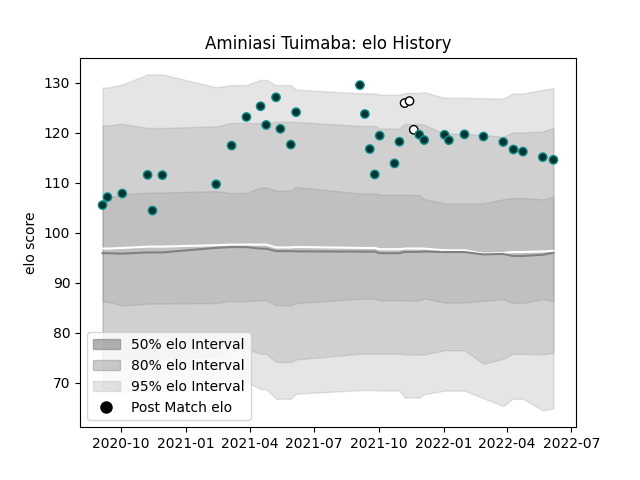

---  
layout: page  
title: Aminiasi Tuimaba  
date: 2023-02-28 11:09:47.892508  
categories: player  
---
# Aminiasi Tuimaba

## Positions: W

## Country: Fiji

## Current elo: 115.0

## Current Percentile: 84.0

# Elo History

# Match History

| Team   |   Appearances |   Win Rate |
|:-------|--------------:|-----------:|
| Pau    |            33 |   0.378788 |
| Fiji   |             3 |   0.5      |

| Opponent             |   Matches |   Win Rate |
|:---------------------|----------:|-----------:|
| Montpellier Herault  |         3 |   1        |
| Toulon               |         3 |   0.166667 |
| Brive                |         3 |   0.333333 |
| Castres Olympique    |         3 |   0        |
| Stade Francais Paris |         3 |   0.333333 |
| La Rochelle          |         3 |   0        |
| Agen                 |         2 |   1        |
| Stade Toulousain     |         2 |   0        |
| Racing 92            |         2 |   0        |
| Perpignan            |         2 |   1        |
| Lyon                 |         2 |   0.5      |
| Clermont Auvergne    |         2 |   0.5      |
| Bayonne              |         1 |   1        |
| Georgia              |         1 |   0.5      |
| Spain                |         1 |   1        |
| Edinburgh            |         1 |   0        |
| Bordeaux Begles      |         1 |   0        |
| Wales                |         1 |   0        |