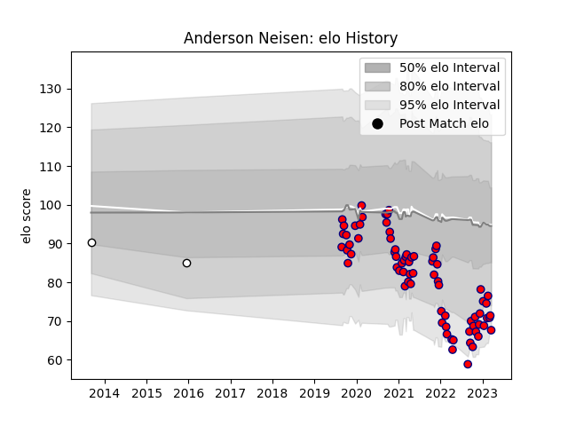

---  
layout: page  
title: Anderson Neisen  
date: 2022-12-18 16:37:20.356114  
categories: player  
---
# Anderson Neisen

## Positions: FB, FH

## Current elo: 85.0

## Current Percentile: 9.0

# Elo History

# Match History

| Team     |   Appearances |   Win Rate |
|:---------|--------------:|-----------:|
| Aurillac |            43 |   0.406977 |
| Brive    |             1 |   0        |

| Opponent                   |   Matches |   Win Rate |
|:---------------------------|----------:|-----------:|
| Beziers                    |         4 |   0.25     |
| Mont-de-Marsan             |         4 |   0        |
| Vannes                     |         3 |   1        |
| Biarritz Olympique         |         3 |   0.333333 |
| Oyonnax                    |         3 |   0        |
| Perpignan                  |         3 |   0.166667 |
| Rouen                      |         3 |   0.666667 |
| Soyaux-Angouleme           |         2 |   1        |
| Carcassonne                |         2 |   0        |
| Colomiers                  |         2 |   1        |
| Grenoble                   |         2 |   0        |
| Valence Romans Drome Rugby |         2 |   0.5      |
| Montauban                  |         2 |   0.5      |
| Nevers                     |         2 |   0        |
| Provence Rugby             |         2 |   1        |
| Toulon                     |         1 |   0        |
| Agen                       |         1 |   0        |
| Bayonne                    |         1 |   0        |
| Massy                      |         1 |   1        |
| Narbonne                   |         1 |   1        |